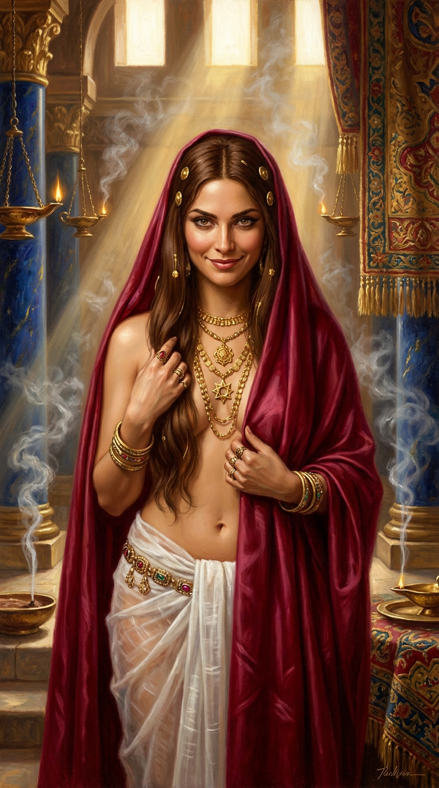
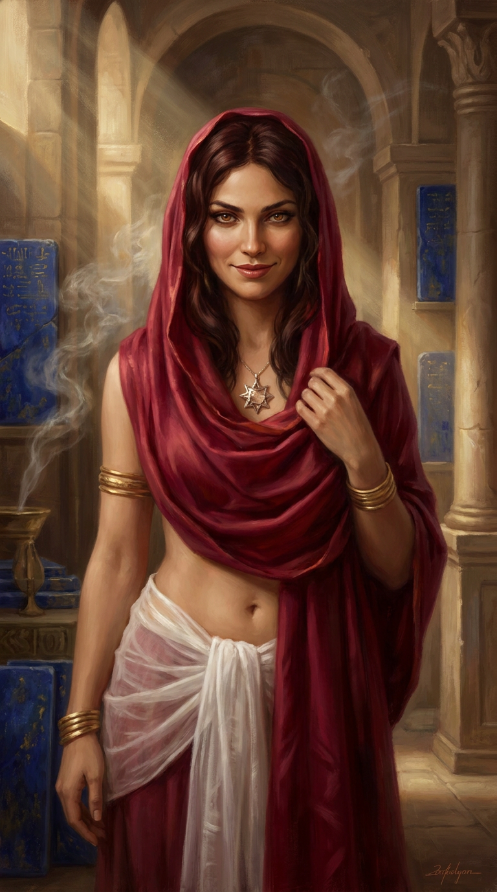

<!-- LTeX: language=es -->

> **Advertencia:** Este artículo describe una clase de personaje para un juego de
> rol de mesa que explora temas de sexualidad, poder institucional y control
> reproductivo como parte de su trasfondo narrativo. Las mecáncias y preceptos
> aquí presentados son herramientas de juego para narrar historias en un
> contexto de fantasía — no un reflejo de creencias o valores personales.

Cuando empecé a dirigir *ACKS II* en mi campaña de los Antiguos Imperios, uno de
los primeros personajes que crearon mis jugadoras fue una
[hojadanzante (Bladedancer)](http://autarch.com/) de Ishtar, una guerrera
consagrada a la diosa mesopotámica del amor y la guerra. Pero pronto surgió la
pregunta: ¿y si alguien quisiera interpretar una sacerdotisa *pura* de Ishtar —
no una danzarina de espadas, sino una cortesana sagrada, una vasija del amor
divino?

La clase Priestest estándar de ACKS II está pensada para deidades pacíficas
(Nephthys, Mityara), con preceptos de castidad, pacifismo y servicio
hospitalario. No encajaba con Ishtar. Así que adapté la clase.

El resultado es una clase variante que reemplaza los poderes de la Priestess
estándar — Consolation, Diplomacy, Lay on Hands — por otros acordes al dominio
dual de Ishtar: **Alluring Beauty**, **Seduction** y **Provoke the Passion**.
Y sus preceptos, lejos de la castidad, exploran un modelo mucho más complejo:
el de las **nadītu** mesopotámicas y las **hieródulas** del mundo antiguo,
mujeres consagradas a una deidad cuya sexualidad era un activo del templo, no
propio.

## La clase en mecánicas

| Aspecto | Detalle |
|---------|---------|
| **Requisito** | Sabiduría 13+ |
| **DG** | 1d4 por nivel |
| **Armadura** | Ninguna — sin armadura ni escudos |
| **Armas** | Estiletes, dagas, dardos, cuchillos arrojadizos |
| **Ataque y salvaciones** | Como mago (*mage*) |

A simple vista, es una clase frágil. Sin armadura y con d4 de golpe, una
sacerdotisa de Ishtar no está hecha para el combate directo. Su fuerza está en
otro sitio.

### Alluring Beauty (Belleza Cautivadora)

Reemplaza a *Consolation*. La sacerdotisa proyecta un aura glamurosa que
asombra y deslumbra. Obtiene **+1 a todas las tiradas de reacción** para
impresionar e intimidar. Si el total llega a **12 o más**, los sujetos actúan
como embelesados mientras estén en su presencia.

Es, mecánicamente, la proficiencia *Mystic Aura* seleccionada como poder de
clase.

### Seduction (Seducción)

Reemplaza a *Diplomacy*. La sacerdotisa está entrenada en el arte del cortejo,
la coquetería y la seducción como herramienta diplomática y sagrada. Obtiene
**+1 a todas las tiradas de reacción** cuando intenta seducir, cortejar o
envolver emocionalmente a una criatura inteligente.

### Provoke the Passion (Provocar la Pasión)

Reemplaza a *Lay on Hands*. Es el poder más táctico de la clase y, para mí, el
más interesante. La sacerdotisa puede usar su belleza para provocar las pasiones
de una criatura inteligente:

- **Acción:** asalto completo.
- **Alcance:** 30' (9 m).
- **Salvación:** El objetivo tira vs. Hechizos.
- **Duración:** 1d4 + nivel asaltos.
- **Efecto:** Depende de la reacción actual del objetivo:

| Reacción Actual | Efecto |
|-----------------|--------|
| **Hostil** | Se enfurece y ataca al grupo sin cuidado |
| **Descortés** | Se vuelve hostil, acosa verbal/físicamente |
| **Neutral** | Se distrae, ignora sus deberes |
| **Indiferente** | Se vuelve amigable, busca ayudar |
| **Amigable** | Se encapricha, ayuda como si estuviera embelesado |

Si la sacerdotisa o un aliado ataca a la criatura mientras está provocada,
esta se enfurece inmediatamente. Es un poder de control social, no de combate —
y eso es precisamente lo que la hace única.

## Los preceptos: el corazón narrativo

La clase estándar de Priestess exige castidad, pacifismo y votos de pobreza
relativa. La sacerdotisa de Ishtar tiene un código mucho más matizado, y creo
que es aquí donde la clase realmente brilla como herramienta narrativa.

### 1. Vestiduras de la Leona

La sacerdotisa debe vestir galas dignas de la gloria de Ishtar en público:
ropajes regios pero sugerentes, joyas con la Estrella de ocho puntas o motivos
de leona, cosméticos que realcen su belleza. Nunca puede aparecer en público
con atuendos mustios o informes.

### 2. Rito del Lucero Vespertino

Debe ofrecer plegarias a Ishtar al atardecer durante una hora, quemando
incienso, ungiéndose con aceites y recitando las gestas de la diosa.

### 3. El Servicio Semanal (**el polémico**)

> La sacerdotisa debe realizar un **acto de cortesana sagrada** en un templo de
> Ishtar al menos **una vez por semana**. Este es un rito de devoción que genera
> ingresos para el templo — el pago del cliente es una ofrenda a Ishtar, no
> beneficio personal.

Si no hay templo disponible (durante viajes o mazmorras), el deber se pospone.
Al regresar a la civilización, debe compensar las semanas acumuladas con
servicio extra o una donación de 200 mo por semana perdida.

**Importante:** Usar *Alluring Beauty* o *Provoke the Passion* durante la
aventura NO es actividad sexual ni cuenta como este deber. Son aplicaciones
tácticas del dominio guerrero de Ishtar — equivalentes a un guerrero blandiendo
su espada.

### 4. Derecho de Conquista

La sacerdotisa no es pacifista. Puede matar en combate, en defensa propia o en
guerra santa. Pero no puede ejecutar a un enemigo rendido o desarmado, a menos
que sea una abominación. Por cada vida que tome en nombre de Ishtar, debe
ofrecer una breve plegaria de agradecimiento.

### 5. Voto de Pertenencia (**el restrictivo**)

> La sacerdotisa pertenece a Ishtar. Su cuerpo y su sexualidad son propiedades
> del templo, no suyas. Solo puede tener actividad sexual cuando esta genere
> beneficio directo para un templo de Ishtar.

Tiene prohibido:
- **Casarse.** Está desposada con Ishtar.
- **Mantener una relación romántica exclusiva.** El afecto genuino hacia una
  sola persona constituye una división de la lealtad debida a la diosa.
- **Tener hijos.** Si concibe, la criatura pertenece al templo, que decidirá
  su crianza y destino.

### 6. Voluntad de la Diosa

No puede usar su magia ni sus encantos para promover el caos o a los enemigos
de Ishtar. Cualquier beneficio material directo obtenido mediante seducción debe
ser donado al templo o empleado para promover la fe.

## Inspiración histórica

Cuando diseñé estos preceptos, quise que tuvieran raíces reales. No quería
inventar un código arbitrario — quería que reflejara cómo funcionaban
realmente los templos de diosas del amor en la Antigüedad.

| Modelo | Cultura | Paralelo |
|--------|---------|----------|
| **Nadītu** | Mesopotamia (Código de Hammurabi, ca. 1750 a.C.) | Mujeres consagradas a un dios. Prohibición expresa de tener hijos y poseer propiedades. El templo controlaba su capacidad económica y reproductiva. |
| **Devadasī** | India medieval (siglos VI-XVII) | "Siervas de la deidad". Casadas con el dios, no podían casarse con mortales. Su actividad sexual generaba ingresos para el templo. |
| **Hieródulas de Comana** | Anatolia (Reino del Ponto, s. I a.C.) | Consideradas esclavas sagradas del templo de Ma. Estrabón reporta miles en una sola ciudad-templo. |
| **Templo de Afrodita en Corinto** | Grecia clásica (s. V a.C.) | Estrabón documenta más de mil *hierodoulai* que generaban riqueza considerable para el templo. |

Este no es un tema cómodo. La prostitución sagrada era, en la práctica, control
institucional sobre el cuerpo y la fertilidad de las mujeres. Pero también era,
en muchas de estas culturas, una de las pocas vías hacia el estatus, la
independencia económica y el poder político femenino. La clase refleja esa
tensión.

## La crisis de fe como drama jugable

El Voto de Pertenencia no es un "no absoluto" — es un "sí, pero con
consecuencias". Si la jugadora decide explorar un romance o una relación, el
conflicto es real y medible:

1. La sacerdotisa pierde sus poderes divinos.
2. Para recuperarlos, debe completar una *Quest* (Geas) impuesta por la suma
   sacerdotisa de su templo.
3. El conjuro *Atonement* (nivel 5) puede restaurarla si hay verdadero
   arrepentimiento.

Esto no es punitivo. Es una **decisión narrativa con peso mecánico**. La
jugadora elige qué es más importante para su personaje: el amor o la fe.

## La ilustración: Madre Aurëlyn

Las imágenes que acompañan este artículo son de **Madre Aurëlyn**, la suma
sacerdotisa de Ishtar en mi campaña. Aurëlyn es una mujer menuda de 32 años, de
cabello largo y castaño, cintura estrecha y una sonrisa que los patricios de
Cimbar describían como "peligrosa". Se formó como cortesana sagrada en la
capital de Chessenta, donde su resplandor beatífico y sus encantos naturales la
convirtieron en una favorita entre la élite.

Su estética — ropajes de lino y seda en púrpura tyria y oro, joyas de
lapislázuli y cornalina, la diadema con la estrella de ocho puntas — es la
imagen misma de la clase que hemos descrito. Es, en muchos sentidos, el
ejemplo perfecto de lo que esta clase variante puede aportar a una mesa de
juego.

## Notas de diseño

Separé el antiguo "deber sexual" unitario en dos preceptos diferenciados:

| Precepto | ¿Qué exige? | ¿Qué restringe? |
|----------|-------------|-----------------|
| **3. Servicio Semanal** | Frecuencia mínima (≥1/semana) | Nada — es un deber positivo |
| **5. Voto de Pertenencia** | Solo para beneficio del templo | Relaciones estables, matrimonio, hijos |

Esta separación permite que la clase sea jugable sin ser incómoda: la jugadora
puede usar todos sus poderes tácticos sin restricción, y el deber semanal es un
marcador de trasfondo, no una mecánica de partida. La restricción real — el
Voto de Pertenencia — solo entra en juego si la jugadora decide explorar ese
terreno narrativo.

La clase está inspirada en parte por el *Ecclesiastic of Aliya* de Arbrethil
(*Customizing the Clergy*, 2024), que ya exploraba una diosa del amor sin
pacifismo ni castidad. Mi contribución fue añadir el control institucional y la
tensión fe vs. amor como drama jugable.

## Disponibilidad

La clase está publicada como material de campaña para mi partida de ACKS II en
los Antiguos Imperios. Si alguien quiere usarla en su propia mesa, solo pido
dos cosas: contexto histórico (no es una clase para cualquier campaña) y
comunicación con tus jugadores sobre los temas que aborda.

*Built with Emanote*