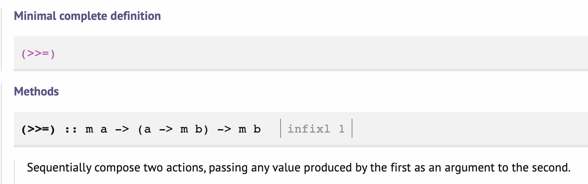

<!-- LTeX: language=es -->


> [!info] Contexto
> Este artículo nace de una sección que creció demasiado en mi [artículo sobre implementar Lox en Haskell](./2026-02-01-lox-en-haskell.md).
>
> Aquí exploro cómo los combinadores permiten construir _parsers_ monádicos complejos componiendo piezas simples, y cómo el concepto de mónada ya aparece en cierta forma en Rust.

Este artículo tiene un poco de miga, pero creo que muestra la verdadera potencia de Haskell y la programación funcional a quienes no la conocen.

La versión de Java del libro **Crafting Interpreters** hace uso del descenso recursivo para implementar el _parser_. Aunque la idea es similar, yo iteré sobre el patrón del escáner y apreté un poco más la tuerca usando unas estructuras bastante potentes, los combinadores de _parsers_ monádicos.

Veamos de qué van.

## ¿Qué es un _parser_?

Un _parser_, al fin y al cabo, no es más que una **función** que acepta una entrada y devuelve una salida. Pero, ¿qué salida?:

```haskell
parser :: Input -> ?
```

En una versión muy simple, podemos tratar de procesar toda esa entrada y devolver nuestro resultado, que puede ser o bien tu tipo de salida (e.g. `Expression`) o un error (quizá pasamos una secuencia de _tokens_ sin ningún sentido).

Como estamos en el mundo puro y matemático no queremos utilizar algo como excepciones que haya que capturar luego o dejar que maten al programa, aunque podemos. En la programación funcional pura y estáticamente tipada, **los errores también son valores**, y el tipo de las funciones contempla el tipo de errores que pueden emitir.

Para codificar esto en la signatura de nuestra función hacemos uso, por supuesto, de ADTs. Un tipo con dos variantes, el éxito y el fallo:

```haskell
data ParseResult = Ok Output
                 | Err ParseError
```

Generalizamos a cualquier tipo y obtenemos:

```haskell
data ParseResult e a = Ok a
                     | Err e

-- Parameterizing with our types
type ParseResultAlias = ParseResult ParseError Output
```

Por supuesto, Haskell tiene ya tipos para representar esto. Tal y como Rust usa su tipo [`Result<T, E>`](https://doc.rust-lang.org/std/result/), aquí usamos `Either e a`.

> [!info]
> Rust y Haskell usan un orden distinto para los parámetros de tipo en `Result` y `Either`. Esto es porque en Haskell nos suele interesar el poder _mapear_ sobre el tipo que queda a la derecha.
>
> Puedes leer un poco al respecto en [este otro artículo](./2024-11-13-mapeando-estructuras.md).

Así que el tipo de mi función _parser_ podría tener esta forma, generalizando sobre el tipo de entrada (que llamamos `s`), el tipo de salida (que llamamos `a`) y el tipo de error (que llamamos `e`):

```haskell
parser :: s -> Either e a
```

## ¿Cómo se _combinan_?

Pero estábamos hablando de **combinadores**. ¿Qué es lo que combinamos? La respuesta es piezas de _parser_ (recuerda, funciones) más pequeñas.

Pero si una función que consume toda la entrada es a su vez una combinación de _sub-funciones_, no tendría demasiado sentido que las funciones pequeñas consumieran toda la entrada. De ser así, solo una de ellas podría consumir la entrada, con el resto de las _sub-funciones_ operando sobre la salida de esta, y la combinación de la que hablamos sería simplemente una composición directa de funciones (e.g. `subParser3(subParser2(subParser1(input)))`).

Si contemplamos más opciones que esta, entonces las _sub-funciones_, en general, no deben consumir toda la entrada.

Entonces, ¿cómo expresamos que la entrada no ha sido consumida al completo en nuestras funciones?

Pues así:

```haskell
parser :: s -> Either e (a, s)
```

Ahora la salida del caso de éxito de mi función es una _**tupla**_ que contiene dos tipos, el tipo de salida **y el resto de la entrada que falta por procesar**.

> [!info]
> En mi implementación [el tipo `Parser` no es exactamente así](https://github.com/DavSanchez/hox/blob/d318b821e162fcd548841b0f7f5d1a9bfd380169/src/Language/Parser.hs#L25-L27) debido a su capacidad de [sincronización y recuperación de errores](https://www.craftinginterpreters.com/parsing-expressions.html#panic-mode-error-recovery), pero no necesitamos cubrir ese aspecto para entender la combinación de _parsers_ monádicos en su forma básica.

Aquí está la forma final que tendría un _parser_ totalmente genérico, encapsulado en una estructura que engloba un único tipo de valor (la función de _parsing_ en sí) y un alias para los tipos concretos con los que vamos a trabajar:

```haskell
newtype Parser e s a = Parser
  { runParser :: s -> Either e (a, s)
  }

data ParseError = ParseError String

-- Parameterizing the input and the error, but not the output!
type TokenParser a = Parser ParseError [Token] a
```

Entonces, estos combinadores irán consumiendo la entrada (`[Token]`) y devolverán el resultado (que puede ser o bien un tipo cualquiera `a` o un `ParseError`).

Asumiendo una secuencia de _tokens_ que únicamente pueda formar una expresión válida, una combinación de estos _parsers_ recibiría la secuencia completa y acabaría con el valor `Right (Expression, [])`. El resultado con variante de la derecha (éxito) con mi valor de tipo `Expression` y la lista de _tokens_ consumida al completo.

> [!tip] ¡Solo es un escáner!
> Es importante que te quedes con la idea de que esto no es muy diferente a lo que hice con el escáner, pero subiendo un poco el nivel de abstracción.
>
> Un escáner no es otra cosa que una función `[Char] -> Either SyntaxError ([Token], [Char])` que consume toda la entrada de golpe, pero las llamadas recursivas intermedias sí que pasan "lo que queda de la lista de caracteres" y a su vez [emitían o un `validToken` o un `syntaxError`](https://github.com/DavSanchez/hox/blob/d318b821e162fcd548841b0f7f5d1a9bfd380169/src/Language/Scanner/Naive.hs#L12-L18)... 😉.

Llegados a este punto, ¿Cómo combinamos estos _parsers_ para generar mi `TokenParser Expression`?

## La palabra que falta

Podemos darle a nuestro tipo `Parser e s a` la capacidad de realizar cierta operación de encadenado con otros parsers de distintos tipos, de forma que cada _parser_ consuma un poco de la entrada, **y luego** el siguiente _parser_ consuma otro poco, y así hasta cuanto queramos. Nosotros determinaríamos cuándo termina la cadena y qué tipo esperamos a la salida. Idealmente, la cadena terminaría cuando no queda más entrada. Por supuesto, si el proceso de _parse_ falla,
simplemente detenemos toda la operación y emitimos el fallo.

Apoyándonos en Rust por familiaridad, podemos buscar alguna función que se parezca a lo que buscamos.

Y _resulta_ (xd) que tenemos un ["**y luego**"](https://doc.rust-lang.org/std/result/enum.Result.html#method.and_then) que se parece bastante a lo que buscamos, entre los métodos de `Result<T, E>`:

```rust
/// Calls `op` if the result is `Ok`, otherwise returns the `Err` value of `self`.
///
/// This function can be used for control flow based on `Result` values.
pub fn and_then<U, F>(self, op: F) -> Result<U, E>
where
    F: FnOnce(T) -> Result<U, E>,
```

`and_then` recibe como parámetro un valor `Result<T, E>` (ese `self`) y una función `FnOnce(T) -> Result<U, E>` (ese `op`), devolviendo el tipo `Result<U, E>`. Es decir, **encadena un resultado con éxito** con una **función que devuelve otro resultado (con éxito o sin él)**. Si el primer resultado no tuvo éxito, devolvemos el error directamente, sin encadenarlo con la función `op`.

Existe un equivalente en Haskell, y el sistema de tipos nos permite expresar esta capacidad de encadenamiento de una forma tan abstracta que, usando la terminología de orientación a objetos por familiaridad, es el equivalente al método de una interfaz. Haskell llama a estas formas de reusar código **clases de tipo** (no confundir con las clases en orientación a objetos) o _typeclass_. En Rust, el equivalente son los _traits_.

Esta clase de tipo, por fin, es la clase [`Monad`](https://hackage-content.haskell.org/package/base-4.22.0.0/docs/Prelude.html#t:Monad). De ahí lo de _parsers monádicos_.

Fíjate en el único método (o más bien operador) que debe definir un tipo para implementar esta clase `Monad`:



> Compone dos acciones secuencialmente, pasando cualquier valor producido por la primera como argumento de la segunda.

Este `>>=` es un operador que une dos argumentos, un valor `m a` (el resultado de la primera acción) y una función `(a -> m b)` (la segunda, que depende del resultado exitoso de la primera).

Te ayudo a unir Haskell y Rust usando una suerte de álgebra de tipos.

- `m _` es `Result<_, E>`.
- `a` es `T`, por tanto `m a` es `Result<T, E>`.
- `b` es `U`, por tanto `m b` es `Result<U, E>`.
- Por tanto, `a -> m b` es `FnOnce(T) -> Result<U, E>`
  - Obviemos _ownership_, semánticas de movimiento de valores, etc, y aceptemos ese `FnOnce` como
_una función cualquiera que acepte un `T` y devuelva un `Result<U, E>`_.

```haskell
-- Haskell       -- Rust
(>>=)            -- fn and_then(
  :: m a         --   self: Result<T, E>,
  -> (a -> m b)  --   op: FnOnce(T) -> Result<U ,E>
  -> m b         -- ) -> Result<U, E>
```

**¡Son lo mismo!** La diferencia es que en Rust no es fácil expresar ese `and_then` para ciertos
grupos de tipos como parte de un _trait_, como en su momento exploramos en mi
[anterior artículo](./2024-11-13-mapeando-estructuras.md), y por ello es un método propio de `Result<T, E>`
(y, por lo mismo, también está definido separadamente para `Option<T>`).

> [!warning]
> Implementar este _trait_ o interfaz `Monad` de cualquier manera no es suficiente
> para disfrutar de sus capacidades. Como estructura derivada de una formalización matemática,
> la implementación **ha de cumplir ciertas leyes**, algunas de las cuales Haskell codifica en
> otros _traits_ como [`Functor`](./2024-11-13-mapeando-estructuras.md) y `Applicative`.
>
> Además, la estructura debe tener cierta _forma_ (resumiendo, debe ser genérica sobre otro tipo).

La magia de este operador es cómo representa la idea que discutíamos al principio: cómo componer
acciones pequeñas en una acción más grande. Y puede que al principio no se vea, pero esta operación
fundamental encarnada en `>>=` está detrás de muchos patrones habituales en programación. Encadenar
operaciones en un _contexto común_:

- El típico _short-circuiting_: Ejecuta funciones falibles una detrás de otra, pero al primer fallo
que encuentres falla toda la operación y no continúes.
- Funciones que pueden retornar un _nulo_ y funciones posteriores que necesitan que se haya devuelto
un valor para ejecutar.
- Funciones asíncronas (`async/await`).
- etc.

## Y bien, ¿qué hemos ganado?

Quizá te hayas fijado en cómo detrás de las clases de tipo de Haskell se hallan operaciones
fundamentales que representan de forma muy abstracta cómo los tipos y las funciones se pueden
combinar entre sí, sin por ello conocer nada sobre los tipos concretos más allá de imponer ciertas
reglas sobre su comportamiento y su _forma_.

A cambio de estos requerimientos (o gracias a ellos), obtienes una serie de operadores gracias a los
cuales puedes componer pequeños _parsers_ para crear _parsers_ mayores, hasta que ensamblas el _parser_
final para tu lenguaje al completo.

Algunos de estos operadores y su función son los siguientes:

- `<$>`: Esto no es más que el operador de la típica función `map` que vemos en otros lenguajes.
  Sirve para aplicar una función `a -> b` a nuestra estructura parametrizada en `a` de forma que
  obtengamos un valor de nuestra estructura parametrizada en `b`. Por ejemplo, si tengo un valor
  de tipo `TokenParser Int` de nombre `myIntParser` puedo obtener un `TokenParser String` haciendo
  `toString <$> myIntParser`.
- `<*>`: Es `<$>` pero de forma que las estructuras con las que operamos estén parametrizadas por
  funciones. Por ejemplo, si tengo un `unaryOperator :: TokenParser (a -> a)` (por ejemplo para
  el token `!` que representara la negación lógica), podría aplicar la función que está dentro del
  `TokenParser` (es decir, mi `a -> a`) a un `TokenParser` parametrizado sobre un tipo que pueda
  servir como parámetro para la función. Por ejemplo, `unaryOperator <*> boolParser` si
  `boolParser :: TokenParser Bool`. Es una forma de secuenciación de operaciones algo menos general
  que `>>=`.
- `*>`: Aplica la función y luego descarta el valor del primer argumento. Esto es útil si nos
  interesa que la primera aplicación no haya fallado, pero no nos interesa su valor. Si con esto no
  lo ves del todo claro, mira los ejemplos a continuación.
- `<*`: Lo mismo, pero descartando el valor del segundo argumento.

Así listados puede que no parezcan muy útiles, pero si los combinamos apropiadamente su potencia
queda al descubierto. Antes de mostrártelo con ejemplos, veamos otras dos utilidades que Haskell
pone a nuestra disposición, una en sintaxis y otra con otra clase de tipo.

## Legibilidad imperativa con la _notación `do`_

Si tuviéramos que escribir un parser que leyera tres tokens consecutivos (imagina que esperando
encontrar un `Expression` cada vez) usando `>>=`, se vería así:

```haskell
parseThreeTokens :: TokenParser [Expression]
parseThreeTokens =
  token >>= \t1 ->
    token >>= \t2 ->
      token >>= \t3 ->
        pure [t1, t2, t3]

token :: TokenParser Expression
token = undefined -- assume a proper implementation
```

Esto no es otra cosa que el viejo _callback hell_ que se padecía en JavaScript. Las operaciones de
vínculo monádico `>>=` se van anidando y el código se vuelve difícil de leer.

Haskell ofrece un poco de "azúcar sintáctico" para trabajar con mónadas: la notación `do`.
El código anterior se puede reescribir así:

```haskell
parseThreeTokens = do
  t1 <- token
  t2 <- token
  t3 <- token
  pure [t1, t2, t3]
```

¡Parece código imperativo! "Lee un token y guárdalo en t1, luego lee otro en t2...".
Pero por debajo, el compilador lo traduce a las llamadas encadenadas de `>>=` que vimos antes.

## Alternativas: Esto o Aquello

Un _parser_ no es solo una secuencia de pasos ("primero esto, _y luego_ esto"). A veces necesitamos opciones ("intenta esto, _y si no funciona_, intenta esto otro").

Por ejemplo, una expresión podría ser un número literal _o_ una cadena de caracteres _o_ una expresión agrupada entre paréntesis.

Para esto existe otra clase de tipos llamada `Alternative`. Define un nuevo operador `<|>` que
representa esta elección. Si intentamos un _parser_ y fallamos, devolvemos el segundo. Por supuesto,
estas operaciones son asociativas (`Alternative` se define como "a monoid on applicative functors"),
así que podemos encadenar varios de estos _parsers_ y devolver el primero que haya funcionado. ¡Y
sin haber consumido la lista de _tokens_ en cada intento!

## El ejemplo para ilustrar todo

¡Por fin!

Imagina que empezamos con una función de tipo `TokenParser` que solo valide si
un predicado respecto a un `Token` se cumple. Como todos los _parsers_ que
hemos modelado hasta ahora, `TokenParser a` es un `Parser` que recibe una lista de `Tokens` (`[Token]`),
emite errores de tipo `ParseError` (cuya forma no hemos explorado) y devuelve un tipo `a`.

Como `satisfy` solo se encarga de fallar si el predicado no se cumple, será un `TokenParser Token`,
porque no fabrica un nuevo valor a partir del `Token` de entrada:

```haskell
satisfy :: (Token -> Bool) -> TokenParser Token
satisfy predicate = Parser $ \case
  (t : tt) | predicate t -> Right (t, tt)                   -- if the predicate holds, we return success (Right)
  (t : tt) -> Left (ParseError "predicate not satisfied")   -- just an example of constructing an error
  [] -> Left (ParseError "no tokens to parse")
```

Ahora imagina que tenemos un _parser_ de operadores unarios (`!` para la negación lógica o el signo
`-` para negar un número). Imagina que podemos tener un _parser_ para cada una de las opciones.

En cada uno de estos _parsers_, podemos hacer uso de `satisfy` para validar si tenemos el _token_
adecuado para representar esta operación (es decir, si estamos ante el _token_ de un `!` o de un `-`):

```haskell
-- Data type representing the operator itself
data UnaryOperator = Bang | Negation

-- With "do notation"
parseBang :: TokenParser UnaryOperator
parseBang = do
  -- I pass the boolean function to `satisfy` but bind it to `_`
  -- because I don't care about the token itself
  _ <- satisfy (\t -> t == '!')  
  pure Bang -- puts a value into the structure (this comes from `Applicative`!)

-- Or, with the combinator operators...
parseBang' :: TokenParser UnaryOperator
parseBang' = satisfy (\t -> t == '!') *> pure Bang

--- then, `parseNegation`, etc
```

¡Si fallamos en `satisfy`, el _parser_ completo falla! Aunque la primera versión de `parseBang` parezca
más natural, fíjate en la capacidad expresiva de la versión utilizando los operadores que combinan
un _parser_ con otro.

¿Quieres más? Combinemos los dos _parsers_ necesarios para cada operador unario en un único _parser_
de operaciones unarias:

```haskell
parseUnaryOperation :: TokenParser UnaryOperator
parseUnaryOperation = parseBang <|> parseNegation
```

Habíamos dicho que las operaciones eran asociativas, por lo que cabe expresar algo como:

```haskell
-- | Comparison chain parser (<, <=, >, >=).
parseComparison = parseGT <|> parseGTE <|> parseLT <|> parseLTE
```

¿Qué pasa cuando hayamos creado un _parser_ de `Expression` y nos falte la versión de una expresión
agrupada entre paréntesis? Con los operadores que descartan argumentos la expresividad es altísima:

```haskell
parseGrouping :: TokenParser Expression
parseGrouping = do
  _ <- satisfy (\t -> t == '(')
  expr <- parseExpression
  _ <- satisfy (\t -> t == ')')
  pure (Grouping expr)

parseGrouping' :: TokenParser Expression
parseGrouping' = leftParen *> (Grouping <$> parseExpression) <* rightParen
  where
    leftParen = satisfy (\t -> t == '(')
    rightParen = satisfy (\t -> t == ')')
```

Con estos dos superpoderes (secuenciación con `do` y elección con `<|>`), el código del parser de Lox en Haskell se parece sorprendentemente a la gramática formal del lenguaje.

Aquí tienes un ejemplo real de mi implementación para parsear una expresión unaria (`!true` o `-5`) donde
sí utilizamos el _token_ que hemos capturado en `satisfy`:

```haskell
unary :: TokenParser Expression
unary =
  ( do
      -- Try to find an unary operator ('!' or '-'), bind it to `operator`
      operator <- satisfy (\t -> t `elem` ['!', '-'])
      -- AND THEN (`>>=`) recursively parse the following as an expression
      rightSide <- unary
      -- Emit the AST node combining all components (where `operator` is of type `Token`)
      pure (Unary operator rightSide)
  )
    -- If we fail above, try with the next level of precedence (function call)
    <|> call
```

Es declarativo, limpio y maneja los errores y el estado (la lista de _tokens_ restantes) automáticamente "entre bastidores" gracias a la clase de tipo mónada y a todos los operadores que los requisitos de esta clase impuso sobre nuestro tipo.

Comparado con la implementación típica de descenso recursivo imperativo, donde tienes que comprobar manualmente `match(TOKEN)` y avanzar el puntero, esto se siente como describir **qué** es el lenguaje en función de las piezas primitivas que lo componen, en lugar de **cómo** leerlo.

## Conclusión

Los combinadores de _parsers_ monádicos son un ejemplo claro de cómo estas abstracciones matemáticas
reducen los problemas a sus elementos primordiales y a cómo se relacionan (componen) entre sí,
llevan a código más expresivo, fácil de componer desde esas piezas pequeñas a piezas más grandes y
también, una vez te acostumbras, ¡muy legible a su manera!

- **`Functor` (`<$>`)**: Nos permite transformar el valor producido sin alterar la estructura.
- **`Applicative` (`pure`, `<*>`, `*>`, `<*`)**: Nos permite secuenciar pasos independientes y combinar sus resultados.
- **`Monad` (`>>=`, `do`)**: Nos permite secuenciar pasos dependientes escondiendo la gestión del estado, errores y otros.
- **`Alternative` (`<|>`)**: Nos permite expresar reglas gramaticales con opciones de forma natural.

Al final, escribir un _parser_ en Haskell se parecen menos a escribir una máquina de estados compleja y más a escribir la gramática EBNF directamente en tu editor. La programación funcional pura y estáticamente tipada favorece la expresión declarativa. El _qué_ antes que el _cómo_.

### Mi implementación de `Monad`, `Alternative` y sus requisitos

Puedes ver un ejemplo aproximado de la pinta que tendrían las implementaciones de clases para
nuestro hipotético _parser_ en mi [implementación real para Lox](https://github.com/DavSanchez/hox/blob/857185920c3f2c805109916c08676ce508d91bef/src/Language/Parser.hs).

Como ya indiqué, mi _parser_ es un poco diferente en su
estructura porque quiero conservar el estado si el _parsing_ falla, pero la implementación no varía
demasiado.

Si te atreves, intenta partir de mi implementación, cambiar el tipo para que se parezca
al de este artículo, y luego modificar las implementaciones de las clases de tipo. El sistema de
tipos de Haskell es bastante potente y te puede ayudar a alcanzar la forma en que encajan todas las
piezas.

>[!tip]
> Algo extremadamente relevante en los tiempos que corren es que un sistema de tipos robusto como el
> de Haskell es ideal para asistirte con IA, porque el compilador no va a aceptar cualquier código.

¡Hasta la próxima!
