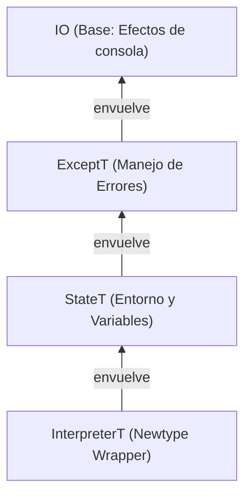

<!-- LTeX: language=es -->

> [!info] O, en resumen,
> _Qué tal estuvo implementar un lenguaje de programación orientado a objetos basado en clases
> usando **programación funcional pura y estáticamente tipada**._
>
> 
>
> Transparencia referencial, inmutabilidad, evaluación perezosa, programación guiada por tipos, mónadas,
> cálculo lambda y otros amigos.

Siempre me atrajo la programación funcional propuesta por **Haskell**.

Programar utilizando propiedades matemáticas, de forma declarativa y con las dependencias
explícitas, ver cómo encajan todas las piezas (y el compilador acepta el programa) cuando tu modelo
de tipos se ajusta al problema, notar cómo tu entendimiento mejora en el proceso.

Otra historia.

Como también me pasa con **Nix**, toda aquella pieza de tecnología con estos principios —a menudo
tras curvas de aprendizaje popularmente elevadas—, que prometa a cambio una mejor perspectiva sobre
la programación o alguno de sus aspectos tangenciales suele ganar mi interés.

Quizá solamente es porque juego al **Bloodborne** y
aplico su filosofía a todos los demás aspectos de mi vida.
En cualquier caso, desde hace años, Haskell es mi lenguaje para proyectos paralelos
y mis entornos de desarrollo y despliegue se describen vía Nix.

Estas perspectivas me acompañan hoy día en mi trabajo diario con Rust, mi lenguaje profesional.
Creo que soy mejor programador gracias a ellas.

## Fabricando intérpretes

Algunos miembros del equipo de Agent Control en New Relic tenemos un club de lectura semanal.
Hace unos meses seleccionamos **Crafting Interpreters** de Robert Nystrom (puedes leerlo
gratis en [su web](<https://www.craftinginterpreters.com>)), en gran parte por ser de naturaleza más
práctica que las lecturas anteriores ([**Rust for Rustaceans**](https://rust-for-rustaceans.com) de
Jon Gjenset y [**Asynchronous Programming in Rust**](https://www.packtpub.com/en-us/product/asynchronous-programming-in-rust-9781805128137) de Carl Fredrik Samson).

El libro implementa un lenguaje de programación orientada a objetos simple llamado **Lox**. Lo hace
dos veces, con estrategias y lenguajes diferentes cada vez. Primero en Java (`jlox`) mediante
recorrido de árboles, luego en C (`clox`) con una máquina virtual de _bytecode_.

Como no queríamos hacer la primera parte en Java (xd) cada uno de nosotros escogió su propio
lenguaje para la primera parte del libro.

Así que ahora ya sabes a qué vino la introducción.

Este artículo explora varios aspectos de mi implementación de `jlox` en Haskell.

> [!tip] ¡Puedes ver mi implementación mientras lees!
> El código de mi implementación, llamada (no muy originalmente) `hox`, está publicado
> [en GitHub](https://github.com/DavSanchez/hox).
> Pasa toda la _suite_ de tests del repositorio oficial de Crafting Interpreters (más sobre esto a
> continuación) para `jlox`, por lo que es conforme a lo especificado en el libro.

Vamos allá.

## Entorno reproducible con Nix

Te lo dije.

Haskell utiliza [`cabal`](https://www.haskell.org/cabal/) como gestor de proyectos. Creo que, aún
con sus asperezas, es una herramienta bastante buena. Sin embargo, como ya decía al principio,
me gustan mis dependencias controladas y descritas lo más completamente posible. #nix es un viejo conocido en este sitio, y por descontado la mejor herramienta a día de hoy para encargarse de eso.

Así que antes de escribir mi primera línea de Haskell me aseguré de que mi entorno de desarrollo
fuese un [_flake_](./hispanix/2024-06-25-entornos-desarrollo.md) en condiciones.
Con el _flake_ pude establecer algunos aspectos que quería desde el minuto uno:

- La versión del compilador que me interesaba
(GHC 9.12.2, para probar las extensiones de [GHC2024](https://ghc.gitlab.haskell.org/ghc/doc/users_guide/exts/control.html#extension-GHC2024))
- Un formateador "único" para todos los tipos de fuentes del proyecto con
[`treefmt`](https://github.com/numtide/treefmt).
- _Pre-commit hooks_ para todas las comprobaciones que me interesaban,
incluyendo _hooks_ custom (`hlint`, `weeder`, `doctest`, etc).
- Un _shell_ de desarrollo con todas las dependencias listas (incluyendo formateador y _hooks_).

Más relevante que todos estos aspectos para comprender la potencia de Nix es el cómo pude utilizarlo
para ejecutar los tests del [repositorio](https://github.com/munificent/craftinginterpreters) de
Crafting Interpreters.

El código de los bancos de tests está escrito en Dart 2, y desde 2023 Dart está en la versión 3.
Dart 3 obliga a asegurar la _Null Safety_, cosa que los tests no habían hecho porque la versión 2 no
lo requiere, así que estos tests no funcionan con la última versión. Si fuese un programador de Dart
y tuviese instalada la versión 3 tendría que pelear con mi entorno para instalar la versión 2 y
poder ejecutar los tests sin alterar mi entorno habitual.
Tal vez alguna herramienta tipo `nvm` para Dart, `asdf` o contenedores...

Pero como uso Nix, no tengo que preocuparme de este problema en absoluto. No tengo que conocer
herramientas específicas para el lenguaje de turno ni arriesgarme a conflictos con herramientas
instaladas globalmente (un saludo, Python).

Busco Dart en el repositorio de paquetes más grande y más actualizado del mundo, `nixpkgs`. Busco
la revisión de `git` de `nixpkgs` que contenga la versión de Dart que me sirve. Fijo la revisión
como entrada a mi _flake_... y listo, **Dart 2.19.6** listo para ejecutar en mi terminal. Gracias a
`direnv`, en el momento en el que salgo del directorio del proyecto el ejecutable de `dart`
desaparece (o volvería a la 3.9.4 si fuese un programador de Dart con una instalación global).

De nuevo, tirando de las funciones de Nix escribo un _script_, también en Haskell, (**_inline!_**)
que llama a Dart como si fuese un _script_ de Bash, de forma que puedo ejecutar los tests de cada
capítulo de forma aislada y pasándole mi implementación del intérprete.

¿Cómo? mira esto (sacado del repo de [Shh](https://github.com/luke-clifton/shh#nix)):

```nix
writers.writeHaskellBin "example" { libraries = [ haskellPackages.shh ]; } ''
  {-# LANGUAGE TemplateHaskell #-}
  import Shh

  -- Load binaries from Nix packages. The dependencies will be captured
  -- in the closure.
  loadFromBins ["${git}", "${coreutils}", "${curl}"]

  main :: IO ()
  main = do
    cat "/a/file"
    cp "/a/file" "/b/file"
''
```

Fíjate en el comentario del centro. Hasta la versión de las `coreutils` está fijada por Nix.

Es un nivel de control inigualable, no vuelves a mirar (ni a ejecutar) un _script_ de Bash igual.

Por supuesto, automatizar la ejecución de estos tests en la CI (mismas versiones de programas, etc,
etc) es trivial. Esto da confianza absoluta: puedo saber si mi implementación actual supera los
tests oficiales y seleccionar granularmente cuántos y cuáles capítulos compruebo, independientemente del lenguaje que haya escogido.

Escribí mi CI para que cada _pull request_ al repositorio implementando un capítulo
debiese pasar todos los tests de dicho capítulo. Nada de medias tintas.

Si quieres verlo, echa un vistazo a mi [`flake.nix`](https://github.com/DavSanchez/hox/blob/1eb3f09d00cf3f1c627bfddd2963441cb2dadef2/flake.nix#L48-L127).

## Escaneando: de la mutabilidad a la recursión de cola

El primer paso de cualquier intérprete es el escáner (o _lexer_). En Java, Nystrom usa estructuras
habituales, `while`s que avanzan sobre la cadena de caracteres de entrada, mutando el estado en cada
iteración (`while (!isAtEnd()) { start = current; ... }`).

¿Cómo te aproximas a esto en Haskell, donde casi todo es inmutable y no hay estado? No es cuestión de tirar de `map` o `foldl` sobre listas de caracteres, porque
puedes necesitar más que un carácter cada vez para determinar ante qué _token_ te
encuentras. Cuando llegas a `=` necesitas más para saber si estás ante un **signo
de igual** o ante un **operador lógico** `==`.

La respuesta a que no haya estado mutable es **llevar el estado contigo en la función**, llamándola recursivamente y pasando explícitamente el estado
actualizado. ¿Te suena lo de las dependencias
explícitas?.

Este es el tipo de mi función de escaneo en Haskell.

> [!info] _First time?_
> Si nunca has visto una firma de tipos de
> Haskell, asume que todos los tipos que aparecen excepto el último son parámetros de la función,
> y el tipo que aparece al final es el tipo de retorno.
>
> Para saber más, lee sobre el [_currying_](https://en.wikipedia.org/wiki/Currying).

```haskell
-- | Scans the input strings and tracks the state: the current line number and the accumulated tokens
naiveScanTokens ::
  -- | Input string (a linked list of characters, `String` == `[Char]`)
  [Char] ->
  -- | Current line number
  Int ->
  -- | Accumulated tokens (my state!)
  [TokenResult] -> 
  -- | Resulting list of tokens, a non-empty list, can contain scanning errors
  NonEmpty TokenResult
```

> [!note] ¿Naíf?
> La función se llama `naiveScanTokens` porque inicialmente exploré, aparte de
> esta versión literalmente escrita caso a caso según leía, otra versión utilizando
> _combinadores de parsers monádicos_ (ya, ya. Sigue leyendo) y la biblioteca
> [`megaparsec`](https://hackage.haskell.org/package/megaparsec).
>
> Finalmente descarté esta segunda opción por una cuestión didáctica a varios niveles:
>
> - Calentamiento después de un par de meses sin tocar Haskell.
> - No usar bibliotecas externas en la implementación.
> - La sección de _parsing_ ya me permitiría usar, también manualmente, los combinadores.
> - Introducir algunos patrones de programación funcional y Haskell a mis compañeros de equipo.
> - Escribir este artículo algún día.

La implementación simplemente hace _pattern matching_ sobre los caracteres de entrada y llama a la
misma función actualizando el estado hasta que termina. Fíjate en cómo capturo cada carácter y cómo
vinculo el resto de la lista a `ss` con el operador `:` en los argumentos de entrada, en el lado
izquierdo de la definición, para pasarla a la nueva llamada en el lado derecho, y cómo en el caso
base añado del estado de entrada (el argumento `tt`) el token `EOL` a la lista de salida (por eso
nunca está vacía) con `:|`.

```haskell
-- We start with the base case: no more characters to process, I just add the EOF token
naiveScanTokens "" l tt = validToken EOF l :| tt
naiveScanTokens ('(' : ss) l tt = naiveScanTokens ss l (validToken LEFT_PAREN l : tt)
naiveScanTokens (')' : ss) l tt = naiveScanTokens ss l (validToken RIGHT_PAREN l : tt)
-- ...
-- Operators
naiveScanTokens ('!' : '=' : ss) l tt = naiveScanTokens ss l (validToken BANG_EQUAL l : tt)
naiveScanTokens ('!' : ss) l tt = naiveScanTokens ss l (validToken BANG l : tt)
-- ...
-- Whitespaces (no newlines)
naiveScanTokens (s : ss) l tt
  | s == ' ' || s == '\r' || s == '\t' =
      naiveScanTokens ss l tt
-- ... all other cases
-- If we reach here, it means we encountered an unexpected character
naiveScanTokens (s : ss) line tt = naiveScanTokens ss line (syntaxError "Unexpected character." line [s] : tt)
```

Tienes una función definida varias veces según los diferentes comportamientos que quieres.
Es como sobrecargar una función por posibles sus valores de entrada.

El código es casi una transcripción directa de las instrucciones del libro. Iba añadiendo los casos
a la función según los leía, pero sin contadores manuales ni constructos de control
de flujo `while` o `for`. Llamada Datos y estado de entrada, transformación, y
nueva llamada con nuevos datos y estado.

Solo hay que pasar un estado inicial (la primera línea y la lista vacía de resultados) junto a la
entrada, que es lo que hago con `scanTokens` (esta solo tiene que aceptar el verdadero _input_):

```haskell
scanTokens :: String -> NonEmpty TokenResult
scanTokens s = reverse (naiveScanTokens s 1 [])
```

Puedes ver la implementación completa de `naiveScanTokens` en mi repositorio ([`Scanner/Naive.hs`](https://github.com/DavSanchez/hox/blob/d318b821e162fcd548841b0f7f5d1a9bfd380169/src/Language/Scanner/Naive.hs#L100))

## _Visitor_ vs _Pattern Matching_ de tipos suma

La sección [_Working with trees_](https://www.craftinginterpreters.com/representing-code.html#working-with-trees)
del capítulo 5 explora las diferencias expresivas entre el paradigma orientado a
objetos y el paradigma funcional, y cómo el patrón de diseño _visitor_ trata de
acercar el estilo funcional al orientado a objetos.

Por supuesto, al acercarme al problema desde la programación puramente funcional,
no iba a necesitar implementar el patrón _visitor_. Como el propio libro menciona:

> Each kind of expression in Lox behaves differently at runtime. That means the
> interpreter needs to select a different chunk of code to handle each expression
> type. With tokens, we can simply switch on the TokenType. But **we don’t have a
> “type” enum** for the syntax trees, just a separate Java class for each one.

¡Nosotros sí que tenemos ese _“type” enum_!

El sistema de tipos de Haskell es una de sus grandes fortalezas. En particular,
tenemos a nuestra disposición los **ADTs** (_Algebraic Data Types_), y su forma
de tipos suma (que también se ve en los `enum` de Rust) cubre este caso con total
naturalidad, particularmente con la sintaxis de Haskell.

La gramática formal para las expresiones de Lox empieza así, sacada tal cual
del libro:

```txt
expression     → literal
               | unary
               | binary
               | grouping ;
```

Y la primera versión de mi AST de expresión expresada como un tipo en Haskell
se veía así:

```haskell
-- | Represents an expression in the AST.
data Expression = Literal Literal
                | Unary UnaryOperator Expression
                | Binary BinaryOperator Expression Expression
                | Grouping Expression
```

Hay información que falta en cada uno de los fragmentos, claro, pero imagino que
pillas la idea 😎.

El intérprete se reduce a una función que encaja cada patrón, como el escáner,
pero esta vez sobre los constructores de variantes del tipo.
Es una solución más concisa que evita escribir un puñado de clases sin métodos para
implementar _visitor_, y por supuesto te ahorra escribir el generador que el autor
tiene que fabricar para agilizar el añadido de dichas clases (son 21).

Puedes ver mi tipo de expresión actual en [`Syntax/Expression.hs`](https://github.com/DavSanchez/hox/blob/d318b821e162fcd548841b0f7f5d1a9bfd380169/src/Language/Syntax/Expression.hs).

## Parseando: combinadores de _parsers_ monádicos

Esta sección creció demasiado, así que he decidido extraerla en su propio artículo para darle la atención que merece.

Si quieres saber cómo funcionan los _parsers_ monádicos, qué tienen que ver con `Result::and_then` en Rust y cómo se combinan para crear estructuras complejas a partir de piezas simples, echa un vistazo a mi **[Introducción a los Combinadores de _Parsers_ Monádicos](./2026-02-01-combinadores-parsers-monadicos.md)**

Allí explico en detalle cómo pasamos de la idea de un escáner manual a una abstracción mucho más potente, declarativa y reutilizable.

## Codificando la distancia de resolución de variables en el AST

Uno de los desafíos más interesantes fue el capítulo de **Resolución de Variables**. En Lox, para manejar cierres (_closures_) correctamente, necesitamos saber a cuántos "saltos" (_scopes_ léxicos) de distancia está definida una variable.

### La solución Java: Side-Tables

En Java, el _Resolver_ recorre el árbol y guarda esta información en un `Map<Expr, Integer>` separado. El AST no cambia. Esto funciona en Java porque cada objeto `Expr` tiene identidad (dirección de memoria) y puede usarse como clave en un mapa.

### El problema en Haskell

En Haskell, los valores son inmutables y estructurales. `Variable "a"` es idéntico a otro `Variable "a"`. No tienen "identidad" por defecto. Para usar un `Map`, necesitaría adjuntar IDs únicos a cada nodo de forma incremental, lo que no escalaría demasiado, o usar trucos inseguros como salir a `IO` para obtener uno aleatorio.

### Type-Driven Development

En lugar de una tabla lateral, decidí que la información de resolución debía vivir **dentro** del propio AST. Pero el `Parser` no conoce esa información en el momento en que emite nuestro AST. ¿Cómo definimos un AST que a veces tiene resolución y a veces no de forma segura?

Con esto de "segura" me refiero a que quiero validar estáticamente que mi AST está en el estado correcto en cada
etapa de su procesamiento. Es decir, mi _parser_ debe ser una función de tipo (obviando posibilidad de errores y otras cosas cubiertas con anterioridad):

```haskell
parser :: [Token] -> UnresolvedAST
```

Y que, del mismo modo, la etapa de resolución sea llevada a cabo por una función `resolver` de tipo:

```haskell
resolver :: UnresolvedAST -> ResolvedAST
```

De forma que al intérprete real del programa solo pueda pasársele el tipo `ResolvedAST`:

```haskell
interpret :: ResolvedAST -> Either RuntimeError ()
```

Esto es la seguridad de tipos o _type safety_, ninguna función debe poder recibir un valor de un tipo que
no le corresponde. Nada de pasarle ASTs ya "resueltos" al `resolver`, o ASTs sin resolver al `interpret`.

Esto se podría lograr parametrizando el tipo de AST con un genérico, pero entonces tendríamos que preocuparnos
de que solo los genéricos apropiados puedan servir como parámetros del AST. Un simple `AST a` no vale, necesito
algún tipo de _restricción_ sobre `a`... Rust utiliza técnicas como [_traits_ sellados](https://rust-lang.github.io/api-guidelines/future-proofing.html) para lograr esto, pero
en Haskell, gracias a su completo sistema de tipos, hay otras opciones.

Para expresar esto, utilicé los conceptos de **Data Kinds** y **Type Families**.

#### ¿Qué es eso de _Kinds_?

He pasado de forma extremadamente superficial en [otro de mis artículos](./2024-11-13-mapeando-estructuras.md), pero aquí ahondo un poco más.

Puedes definir un tipo como **el conjunto de valores contenidos en ese tipo**:

- `Bool` es un tipo que contiene a los valores `True` y `False`.
- `Int` es un tipo que contiene a los valores enteros (..., `-2`, `-1`, `0`, `1`, `2`, etc).

Se puede decir que los valores (_terms_) pertenecen al _universo_ de sus tipos. `False` pertenece al
universo de `Bool`, `-1` al universo de `Int`, etc.

Los tipos, a su vez, tienen su propia clasificación, subiendo un nivel de abstracción, llamada `Kind`.
En función de cómo de genéricos son, los tipos están englobados en sus propios _universos_ o `Kind`s.

- `Type` es el _universo_ (`Kind`) de los tipos básicos.
  - `Bool` e `Int` son tipos dentro de este _universo_.
  - `Maybe Int` o `Either String ()` también pertenecen a este _universo_.
- `Type -> Type` es el _universo_ de los tipos que tienen un parámetro genérico desconocido.
  - `Maybe` (¡pero no `Maybe Int`!) pertenece a este _universo_.
  - `Either String` (¡pero no `Either String ()`!) también pertenece a este _universo_.
- `Type -> Type -> Type` es el _universo_ de los tipos que tienen dos parámetros genéricos desconocidos.
  - `Either` (sin especificar ninguno de sus parámetros) pertenece a este _universo_.

Hay otros universos, y pueden combinarse de varias formas.

Sabemos que en Haskell puedes crear tus propios tipos. ¿Podríamos crear nuestros propios `Kind`s?
Si creo mi propio `Kind`, ¿Qué tipos viven dentro de él? ¿Qué valores tienen esos tipos?

Eso es permitido por lo que se conoce como **Data Kinds**. Cada vez que definimos un tipo, Haskell crea un `Kind` con el mismo nombre, y los constructores de valor del tipo original son como tipos, aunque no se pueden construir valores de estos.

```haskell
data MyBool   -- This is a type
  = MyTrue    -- This is a value constructor
  | MyFalse   -- This is another value constructor

{-
-- behind the scenes, it's like Haskell created the following:
kind MyBool    -- This is a Kind
  = MyTrue    -- This is a type!
  | MyFalse   -- This is a type!
-}
```

Pero si no puedo construir valores de estos extraños tipos promocionados a partir de un tipo convencional,
¿para qué sirven? Una respuesta fácil es **etiquetar otros tipos**, de forma que obtengo la restricción
que buscaba para el parámetro genérico de mi tipo AST.

```haskell
-- Definimos las fases de resolución del AST
data Phase = Unresolved | Resolved

-- Haskell crea la `Kind` llamada `Phase` entre bambalinas.

-- El AST usa esta `Kind` como parámetro, `p` solo puede ser `Unresolved` o `Resolved`!
data Expression (p :: Phase)
  = ...
```

Aún nos queda un detalle. Si este `Kind` no puede generar valores, y mi resolución necesita esta
información dinámicamente (una variable puede estar definida 2 _scopes_ léxicos por encima, o 3,
o podría ser una variable global) ¿Cómo la incorporamos al AST si hemos restringido los tipos genéricos
a este `Kind`?

Aquí intervienen las **Type Families**.

#### **Type Families**

Una familia de tipos o _type family_ no es otra cosa que una función de tipo a tipo. Como tal, solo
existe en tiempo de compilación, pero eso no la hace ni mucho menos inútil.

Siendo que nuestro AST está parametrizado por un `Kind` que tiene tipos pero no puede tener valores
en tiempo de ejecución, la _type family_ puede relacionar los tipos de este `Kind` con tipos que sí
puedan tener valores.

Siguiendo con nuestro ejemplo:

```haskell
-- Definimos las fases de resolución del AST
data Phase = Unresolved | Resolved

-- Un tipo sin valores posibles, "zero-sized"
data NotResolved

-- Un tipo con valores que representa una resolución concreta, global o local
data Resolution
  = Global -- Variable global
  | Local Int -- Variable local a X (Int) scopes de distancia

-- Haskell crea la `Kind` llamada `Phase` entre bambalinas.
-- También crearía `Kind`s para `NotResolved` y `Resolution`, pero no nos interesan.

-- Una familia de tipos que cambia según la fase
-- Funciones que reciben un tipo (de `Kind Phase`) y devuelven otro tipo (de `Kind Type`),
-- en este caso, los tipos definidos anteriormente
type family ResolutionInfo (p :: Phase) :: Type where
  ResolutionInfo 'Unresolved = NotResolved 
  ResolutionInfo 'Resolved = Resolution

-- El AST usa esta familia de tipos
data Expression (p :: Phase)
  = VariableExpr
      Int                -- Línea
      String             -- Nombre
      (ResolutionInfo p) -- La type family es aplicada a `p`
  -- ...
```

La _type family_ es una función, en tiempo de compilación relaciona el `Kind` `Phase` con un tipo
concreto, de esta forma el tipo genérico `p` de nuestro AST no puede ser cualquier cosa, solo lo que
nosotros definamos, ¡y en tiempo de compilación!

¡Esto es **Type-Driven Development**!

1. El `Parser` produce un `Program 'Unresolved`.
2. El `Resolver` toma un `Program 'Unresolved` y devuelve un `Program 'Resolved`.
3. El `Interpreter` **solo** acepta `Program 'Resolved`.

```haskell
-- Interpreter.hs
programInterpreter :: Program 'Unresolved -> Interpreter ()
programInterpreter prog = do
  let (resolvedProg, errors) = runResolver (programResolver prog)
  if null errors
    then interpretProgram resolvedProg -- Aquí GHC sabe que es seguro
    else throwError (Resolve errors)
```

>[!note]
> Fíjate en que las firmas de tipo mencionan los tipos del `Kind` `Phase` como `'Unresolved` y
> `'Resolved` respectivamente, con un apóstrofe delante. Esto es para desambiguar con los constructores
> de valores del tipo convencional `Phase`, que sigue pudiendo definir valores en tiempo de ejecución
> aunque no se use para ello.

Si intento ejecutar un programa sin resolver, ¡el código ni siquiera compila! Es una garantía de seguridad que otros lenguajes, ni siquiera Rust, pueden ofrecer tan fácilmente.

##### Un breve paso por los GADTs

Otra forma que exploré para codificar esto fueron los **GADTs (Generalized Algebraic Data Types)**, una suerte de
tipos genéricos cuyo parámetro genérico está determinado por su constructor de datos, pero finalmente la solución
con **Data Kinds** y **Type Families** estaba más alineada con lo que quería lograr.

## Gestionando el Estado: Restricciones por clases y MTL

En Java, el intérprete es una clase con campos mutables (`environment`). En Haskell, la mutabilidad y los efectos deben ser explícitos. Mi implementación utiliza la librería [**MTL (Monad Transformer Library)**](https://hackage.haskell.org/package/mtl) para construir una pila de efectos cuyo requerimiento es que cumplan la interfaz mónada:

```haskell
newtype InterpreterT m a = Interpreter
  { runInterpreterT :: StateT (ProgramState Value) (ExceptT InterpreterError m) a
  }
  deriving newtype
    ( Functor,
      Applicative,
      Monad,
      MonadState (ProgramState Value),
      MonadError InterpreterError,
      MonadIO
    )

type Interpreter = InterpreterT IO -- concrete implementation
```

Visualmente, la pila de efectos se ve así:



La capacidad de Haskell de generar las implementaciones de `Functor`, `Applicative`, `Monad` y
las clases de transformadores (`MonadState`, `MonadError`, `MonadIO`) automáticamente, como se ve en ese `deriving newtype ...` hace muy sencillo trabajar con ellas.

Lo interesante aquí no es solo la pila de mónadas ni que las implementaciones se generen automáticamente, sino cómo se utilizan. La mayoría de las funciones del intérprete no conocen el tipo concreto sobre el que operan. En su lugar, utilizan **restricciones de clases de tipos** (_typeclass constraints_):

```haskell
evaluateExpr :: (
  MonadState (ProgramState Value) m,
  MonadError InterpreterError m
  ) => Expression 'Resolved -> m Value
```

Esta firma dice: "esta función funciona en cualquier mónada `m` que tenga un estado de tipo `ProgramState` y pueda lanzar errores de tipo `InterpreterError`". Esto desacopla la lógica de la implementación concreta (mi tipo `Interpreter`), facilitando los tests y permitiendo reutilizar funciones en diferentes contextos (como el `Resolver`, que comparte algunas de estas capacidades pero no todas, teniendo una estructura en cierto modo similar al `Interpreter`).

No es más que inyección de dependencias para efectos en Haskell, donde _efecto_ es algo tan general
como "puede fallar con este tipo de error", "gestiona estados de este tipo", etc.

Un detalle elegante es cómo se manejan los _scopes_. En Java podríamos usar `try-catch-finally` para asegurar que, al salir de un bloque, el entorno anterior se restaura. En Haskell, uso `catchError` (una función que es
proporcionada por la clase `MonadError`, nada que ver con excepciones) junto con las primitivas de estado:

```haskell
executeBlock decls = do
  modify pushScope        -- Entrar en nuevo scope
  -- Si 'go decls' falla, ejecutamos el handler que hace popScope y relanza el error
  r <- catchError (go decls) (\e -> modify popScope >> throwError e)
  modify popScope         -- Salir del scope (caso exitoso)
  pure r
```

Haskell también tiene excepciones, pero trato de no utilizarlas en favor de tratar lo más posible a
los **errores como valores**.

## Errores como Valores

Una de las diferencias filosóficas más grandes de mi implementación respecto a la del libro es el manejo de errores. En lugar de que el flujo de control salte mágicamente (con las exceptiones), los errores son valores (`Left InterpreterError`) que se propagan.

Aunque `ExceptT` o la implementación monádica de `Either b` hacen que parezca imperativo trabajar con errores (puedes hacer _short-circuiting_), su estatus de tipos de pleno derecho te obliga a ser consciente de en qué partes del código pueden fallar las cosas y con qué valores pueden fallar. ¡La firma de tipos lo indica!

Da una tranquilidad enorme saber que, en general, mirar una firma de tipos ya te dice si una función puede fallar o no. Esto se extiende a saber si una función es **pura** o interactúa de alguna forma con el _mundo exterior_ (cuando `IO _` aparece en el valor de retorno).

## Azúcar Sintáctico: Pattern Synonyms

En mi implementación del flujo de control y particularmente en los retornos de función (esos `return true;`), de nuevo queriendo distanciarme del uso de excepciones para expresarlas, como hace la implementación de Java (😭💀) me encontré con un patrón común. Necesitaba un tipo que representara "seguir ejecutando" o "detenerse y devolver un valor".

Podría haber usado `Either b c`, pero quería algo más descriptivo, y estando familiarizado con [el tipo `ControlFlow` de Rust](https://doc.rust-lang.org/stable/std/ops/enum.ControlFlow.html) decidí crear mi propia versión, sin que fuera nada del otro mundo:

```haskell
data ControlFlow b c
  = Break b     -- Detener el flujo con un valor (ej. return)
  | Continue c  -- Seguir ejecutando (también con un valor, ¿quién sabe?)
```

Sin embargo, leer `Break` cuando estamos implementando una sentencia `return` me producía un poco de disonancia cognitiva, así que eché mano de otra de las herramientas de tipado de Haskell, los **Pattern Synonyms**. Me permiten crear un "constructor virtual" que hace de alias de uno existente:

```haskell
{-# LANGUAGE PatternSynonyms #-}

{-# COMPLETE Return, Continue #-}
data ControlFlow b c
  = Break b
  | Continue c
  deriving stock (Show, Eq)

-- | Pattern synonym for 'Break' to represent a return value in control flow.
pattern Return :: b -> ControlFlow b c
pattern Return x = Break x
```

Añadiendo un pragma `COMPLETE` para que el chequeo de patrones del compilador considere que cubrir `Continue` y `Return` sea exhaustivo sobre todas las variantes del tipo `ControlFlow`, mi código del intérprete puede usar `Return` como si fuera un constructor real, haciendo que la intención sea muy clara:

```haskell
runFunctionBody ::
  ( MonadState (ProgramState Value) m,
    MonadError InterpreterError m,
    MonadIO m -- functions can print to screen, check the time, etc
  ) =>
  [Declaration 'Resolved] -> m Value
runFunctionBody [] = pure VNil
runFunctionBody (d : ds) =
  interpretDeclF d >>= \case
    Return v -> pure v -- yeah Return as Break!
    Continue () -> runFunctionBody ds
```

Es un pequeño detalle, pero demuestra cómo Haskell te permite modelar el dominio de tu problema no solo en los tipos, sino también en la sintaxis misma. ¿Es sobre-ingeniería para este intérprete? Totalmente. Pero parte de la diversión de usar un lenguaje así de expresivo en el tipado (y en general) es ver hasta dónde puedes llegar con él.

## Testeo de propiedades

Además de la _suite_ oficial de tests de Lox, que son casos de ejemplo específicos que analizan la salida de tu programa, lo que no te permite saber _dónde_ tienes el _bug_, aproveché el ecosistema de Haskell para añadir **_Property-Based Testing_** con [`QuickCheck`](https://hackage.haskell.org/package/QuickCheck), una utilidad de test muy conocida, que utilizé desde el _framework_ [`tasty`](https://hackage.haskell.org/package/tasty).

En lugar de escribir `assert(scan("((") == [LEFT_PAREN, LEFT_PAREN])`, defino propiedades universales que mi código debe cumplir para _cualquier_ entrada generada aleatoriamente. Por ejemplo, mi escáner debe cumplir siempre que:

1. La lista de _tokens_ resultante nunca puede ser más larga que la cadena de entrada (más uno por el EOF).
2. El escaneo siempre termina en un _token_ `EOF` o en un error de "String no terminado".

```haskell
-- test/Scanner/Props.hs
scannerProperties :: TestTree
scannerProperties = 
  testGroup "Scanner Property Tests"
    [ testProperty "Always ends in EOF or an unterminated string error" eofOrUnterminatedString
    , testProperty "Less or equal tokens than input length" lessOrEqualTokensThanInputLength
    ]
```

Es una forma limitada de _fuzz testing_ que comprueba una propiedad en tus funciones generando muchos parámetros aleatorios, pasándolos a tu función repetidas veces y, por medio de técnicas de _shrinking_, mostrándote el mínimo ejemplo donde tus invariantes no se cumplen si lo hay. Es ideal para encontrar esos _casos esquineros_ (como cadenas vacías, o llenas de caracteres nulos) que a veces se nos pasa cubrir con tests unitarios convencionales.

## Conclusiones

Implementar Lox en Haskell ha sido un ejercicio de traducción cultural.

- Donde OOP ve **Comportamiento encapsulado con Datos**, FP ve **Datos puros y Funciones transformadoras**.
- Donde OOP usa **Identidad de Objetos**, FP usa **Tipos Estructurales**.
- Donde OOP usa **Excepciones y Mutabilidad**, FP usa **Mónadas y Transformadores**.

Arquitecturas como la **Resolución basada en Tipos** me han mostrado un poder de expresividad y seguridad que difícilmente quiero abandonar para volver al mundo de `void foo()`. Haskell es una herramienta inmensamente poderosa que no solo resuelve problemas, sino que afila la mente del programador en el proceso.

El código completo está disponible en el repositorio.

## Siguientes pasos

### Rendimiento

Mi implementación es una traducción en algunos casos equivalente a la de Java que iba siguiendo, en otros casos necesitada de enfoques alternativos.

Cuando la sección del _tree-walk interpreter_ daba paso a la sección de la _bytecode virtual machine_ el autor de Crafting Interpreters propone ver cuánto tarda en nuestra implementación la clásica implementación mala del cálculo de sumas de números de Fibonacci:

```lox
fun fib(n) {
  if (n < 2) return n;
  return fib(n - 1) + fib(n - 2); 
}

var before = clock();
print fib(40);
var after = clock();
print after - before;
```

¡Huelga decir que el rendimiento de mi implementación deja bastante que desear!

La elección de determinadas estructuras de datos, por ejemplo las listas enlazadas tan ubicuas en
Haskell, o la evaluación perezosa por defecto pueden hacer difícil analizar tus cuellos de botella
con claridad, así que una de las próximas áreas de trabajo es mejorar en este aspecto.

#### _Benchmarks_ en CI

No se puede mejorar lo que no se mide. Para asegurarme de que mis cambios futuros realmente mejoren el
rendimiento del intérprete, o al menos no lo empeoren, integré una suite de **benchmarks** utilizando `tasty-bench`.

Elegí `tasty-bench` sobre el clásico `criterion` por su integración natural con el resto de mi infraestructura de tests, que ya estaba basada en el ecosistema de `tasty`. Utilicé como _benchmark_ inicial para intérpretes es la función de Fibonacci de antes, que estresa la resolución de variables, las llamadas a función y las operaciones aritméticas básicas.

Pero ejecutar benchmarks en mi máquina no es suficiente. Quería visualizar la tendencia histórica. Para ello, escribí un _workflow_ de **GitHub Actions** que:

1. Ejecuta los benchmarks en Linux (x64 y ARM) y macOS.
2. Convierte los resultados a JSON usando un pequeño script de Python.
3. Utiliza la acción `benchmark-action/github-action-benchmark` para generar gráficas de evolución y notificarme si un _commit_ introduce una regresión de rendimiento superior al 150%.

Esto convierte el rendimiento en una propiedad observable del proyecto, a la espera de que haga algo por mejorarla.

### La _bytecode virtual machine_, en Rust

Como ya mencioné, el libro _Crafting Interpreters_ tiene una segunda parte: una máquina virtual de _bytecode_ escrita en C (`clox`). Esta vez todos los compañeros del club de lectura hemos estado de acuerdo en utilizar **Rust**, pero ya que lo utlizamos diariamente en su forma _segura_, aprovecharemos para seguir los detalles de la implementación en C, sumergirnos de lleno en ámbitos `unsafe` y crear nuestras propias estructuras de datos desde cero (nuestros propios _arrays_ dinámicos en lugar de usar `Vec`, etc). Ya veremos cuando lleguemos a la sección de _garbage collection_... ¡Tiene pinta de que lo vamos a pasar especialmente "bien"!

Al momento de escribir este artículo apenas estamos empezando, pero puedes seguir el desarrollo de mi implementación (llamada, no muy originalmente, `rox`) [aquí](https://github.com/DavSanchez/rox).

Veamos si el repaso del paradigma funcional puro que seguí en `hox` puede ayudarme en `rox` con _unsafe_ Rust.
Como mínimo, seguro que sigo dándole la vara a mis compañeros con la programación guiada por tipos.

¡Hasta otra!
