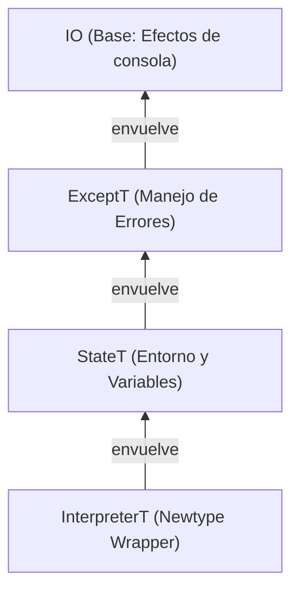

<!-- LTeX: language=es -->

> [!info] O, en resumen,
> _Qué tal estuvo implementar un lenguaje de programación orientado a objetos basado en clases
> usando **programación funcional pura y estáticamente tipada**._
>
> 
>
> Transparencia referencial, inmutabilidad, evaluación perezosa, programación por tipos, mónadas,
> cálculo lambda y otros amigos.

Siempre me atrajo la programación funcional con **Haskell**.

Programar utilizando propiedades matemáticas, de forma declarativa y con las dependencias
explícitas, ver cómo encajan todas las piezas (y el compilador acepta el programa) cuando tu modelo
de tipos se ajusta al problema, notar cómo tu entendimiento mejora en el proceso. Otra historia.

Como también me pasa con **Nix**, toda aquella pieza de tecnología con estos principios —a menudo
tras curvas de aprendizaje popularmente elevadas—, que prometa a cambio una mejor perspectiva sobre
la programación o alguno de sus aspectos tangenciales suele ganar mi interés.

Quizá solamente es porque juego al Bloodborne y
aplico su filosofía a todos los demás aspectos de mi vida.
En cualquier caso, desde hace años, Haskell es mi lenguaje para proyectos paralelos
y mis entornos de desarrollo y despliegue se describen vía Nix.

Estas perspectivas me acompañan hoy día en mi trabajo diario con Rust, mi lenguaje profesional.
Creo que soy mejor programador gracias a ellas.

## Fabricando intérpretes

Algunos miembros del equipo de Agent Control en New Relic tenemos un club de lectura semanal.
Hace unos meses seleccionamos **Crafting Interpreters** de Robert Nystrom (puedes leerlo
gratis en [su web](<https://www.craftinginterpreters.com>)) como lectura, en gran parte por ser de
naturaleza más práctica que las lecturas anteriores
([**Rust for Rustaceans**](https://rust-for-rustaceans.com) de Jon Gjenset y
[**Asynchronous Programming in Rust**](https://www.packtpub.com/en-us/product/asynchronous-programming-in-rust-9781805128137)
de Carl Fredrik Samson).

El libro implementa un lenguaje de programación orientada a objetos simple llamado **Lox**
dos veces, con estrategias y lenguajes diferentes cada vez.
Primero en Java (`jlox`) mediante recorrido de árboles,
luego en C (`clox`) como una máquina virtual de _bytecode_.

Como no queríamos hacer la primera parte en Java (xd) cada uno de nosotros escogió su propio
lenguaje para la primera parte del libro.

Así que ahora ya sabes a qué vino la introducción.

Este artículo explora varios aspectos de mi implementación de `jlox` en Haskell.

> [!tip] ¡Puedes ver mi implementación mientras lees!
> El código de mi implementación, llamada (no muy originalmente) `hox`, está publicado
> [en GitHub](https://github.com/DavSanchez/hox).
> Pasa toda la _suite_ de tests del repositorio oficial de Crafting Interpreters (más sobre esto a
> continuación) para `jlox`, por lo que es conforme a lo especificado en el libro.

## Entorno reproducible con Nix

Haskell utiliza [`cabal`](https://www.haskell.org/cabal/) como gestor de proyectos. Creo que, aún
con sus asperezas, es una herramienta muy buena. Sin embargo, como ya decía al principio, me gustan
mis dependencias controladas y descritas lo más completamente posible. #nix es un viejo conocido en
este sitio, y por descontado la mejor herramienta a día de hoy para encargarse de eso.

Así que antes de escribir mi primera línea de Haskell me aseguré de que mi entorno de desarrollo
fuese un [_flake_](./hispanix/2024-06-25-entornos-desarrollo.md) en condiciones.
Con el _flake_ pude establecer algunos aspectos que quería desde el minuto uno:

- La versión del compilador que me interesaba 
(GHC 9.12.2, para probar las extensiones de [GHC2024](https://ghc.gitlab.haskell.org/ghc/doc/users_guide/exts/control.html#extension-GHC2024))
- Un formateador "único" para todos los tipos de fuentes del proyecto con
[`treefmt`](https://github.com/numtide/treefmt).
- _Pre-commit hooks_ para todas las comprobaciones que me interesaban,
incluyendo _hooks_ custom (`hlint`, `weeder`, `doctest`, etc).
- Un _shell_ de desarrollo con todas las dependencias listas (incluyendo formateador y _hooks_).

Más relevante que todos estos aspectos para comprender la potencia de Nix es el cómo pude utilizarlo
para ejecutar los tests del [repositorio](https://github.com/munificent/craftinginterpreters) de
Crafting Interpreters.

TODO SIGUE AQUI

Aquí hubo un reto interesante: los tests originales de *Crafting Interpreters* fueron escritos para **Dart 2 (2.19.6 o menor)**, pero la versión actual en Nixpkgs al momento de escribir esto es la **3.9.4**, con la cual los tests no ejecutan.

En un entorno tradicional, esto significaría instalar versiones antiguas de Dart globalmente, arriesgando conflictos o teniendo que usar gestores de versiones complejos (`asdf`, `nvm`, etc.). **Con Nix, el problema desaparece.**

Simplemente añadí una entrada en mis `inputs` apuntando a un commit específico de nixpkgs de hace unos años que contenía **Dart 2.19.6**. De esta forma, cuando entro en mi *shell* de desarrollo (`nix develop`), tengo disponible esa versión exacta de Dart, junto con GHC y mis herramientas. **En el momento en que salgo de esa shell, todo desaparece.**

Mi ordenador sigue limpio, sin versiones conflictivas de Python, Ruby o Dart peleándose entre sí. Es la higiene definitiva para el desarrollador: dependencias aisladas, reproducibles y efímeras por proyecto.

Lo más potente es cómo orquesto estos tests. En lugar de un script de Bash frágil, utilizo `pkgs.writers.writeHaskellBin` para escribir un **script de Haskell inline dentro de mi propio `flake.nix`**:

```nix
# flake.nix (extracto)
crafting-interpreters-script = interpreter:
  pkgs.writers.writeHaskellBin "crafting-interpreters-script" {
    libraries = [ pkgs.haskellPackages.shh ... ];
  } ''
    {-# LANGUAGE TemplateHaskell #-}
    import Shh
    -- ... código Haskell real ...
    main :: IO ()
    main = do
       -- Lógica compleja de tests, descarga de repos, ejecución de dart...
       dart "tool/bin/test.dart" target "--interpreter" ...
  '';
```

Esto significa que tengo toda la potencia de Haskell (tipado estático, librerías como `shh` para shell scripting) disponible *dentro* de mi definición de infraestructura. Es un nivel de control y robustez que Bash simplemente no puede ofrecer.

Esto me dio una confianza absoluta: si mi intérprete pasaba los tests oficiales, mi lógica era correcta, independientemente del lenguaje.

## 2. Adiós Visitor, Hola Pattern Matching

En la implementación Java, Nystrom usa el **Visitor Pattern** para recorrer el Árbol de Sintaxis Abstracta (AST). Es el mecanismo estándar en OOP para separar algoritmos de estructuras de datos, aunque conlleva una verbosidad inherente en su implementación.

En Haskell, este patrón es redundante. El uso de **Tipos de Datos Algebraicos (ADTs)** junto con **Pattern Matching** permite una expresión mucho más directa del comportamiento.

Mi AST de expresiones (`Expression.hs`) se ve así:

```haskell
data Expression (p :: Phase)
  = Literal Literal
  | BinaryOperation Int BinaryOperator (Expression p) (Expression p)
  | VariableExpr Int String (ResolutionInfo p)
  -- ...
```

El intérprete se reduce a una función que despacha sobre los constructores del tipo. Es una solución más concisa que evita la dispersión lógica de las clases *visitor* del modelo original.

## 3. El Escáner: De Java a Haskell

El primer paso de cualquier intérprete es el escáner (o lexer). En Java, Nystrom implementa un bucle `while` que avanza un puntero sobre la cadena de entrada, carácter por carácter, con mucha gestión de estado mutable (`current`, `start`, `line`).

En Haskell, el enfoque natural es recursivo. Mi función `naiveScanTokens` consume la lista de caracteres de entrada y acumula tokens:

```haskell
naiveScanTokens :: String -> Int -> [TokenResult] -> NonEmpty TokenResult
-- Caso base: fin de la entrada
naiveScanTokens "" l tt = validToken EOF l :| tt
-- Tokens simples
naiveScanTokens ('(' : ss) l tt = naiveScanTokens ss l (validToken LEFT_PAREN l : tt)
-- Comentarios: consumimos hasta el salto de línea
naiveScanTokens ('/' : '/' : ss) l tt = naiveScanTokens (dropWhile (/= '\n') ss) l tt
-- ...
```

Gracias al *Pattern Matching* sobre listas (`'(' : ss`), el código es casi una transcripción directa de la especificación léxica. No hay contadores manuales ni bucles `while`; la propia estructura de los datos guía el flujo.

## 4. Parsers Artesanales: Combinadores Monádicos

Frente al parser de descenso recursivo imperativo de Java, en Haskell opté por el uso de **Parser Combinators**.

Aunque existen librerías consolidadas como Megaparsec, decidí implementar una mónada `Parser` propia. No por necesidad técnica, sino por el valor pedagógico de construir la abstracción desde sus cimientos. El objetivo era comprender la gestión del estado y la composición de errores sin capas intermedias.

```haskell
newtype Parser e s a = Parser
  { runParser :: s -> (Either e a, s)
  }
```

La magia ocurre al implementar la instancia de `Alternative`. Esto nos permite definir la gramática de una forma casi declarativa usando el operador `<|>` (o):

```haskell
variable :: TokenParser (Variable 'Unresolved)
variable = do
  void $ satisfy ((VAR ==) . tokenType) "Expect 'var'."
  (name, l) <- variableName
  -- Intentamos con inicializador, o si falla, sin él.
  initExpr <- withInitializer <|> noInitializer 
  pure $ Variable name initExpr l
```

Este enfoque permite componer parsers pequeños para construir otros más complejos, manteniendo el código extremadamente limpio y cercano a la notación BNF de la gramática.

## 5. El Gran Reto: "Resolution Distance" y Árboles que Crecen

Uno de los desafíos más interesantes fue el capítulo de **Resolución de Variables**. En Lox, para manejar cierres (closures) correctamente, necesitamos saber a cuántos "saltos" (scopes) de distancia está definida una variable.

### La solución Java: Side-Tables

En Java, el Resolver recorre el árbol y guarda esta información en un `Map<Expr, Integer>` separado. El AST no cambia. Esto funciona en Java porque cada objeto `Expr` tiene identidad (dirección de memoria) y puede usarse como clave en un mapa.

### El problema en Haskell

En Haskell, los valores son inmutables y estructurales. `Variable "a"` es idéntico a otro `Variable "a"`. No tienen "identidad" por defecto. Para usar un `Map`, necesitaría adjuntar IDs únicos a cada nodo o usar trucos inseguros.

### La solución Haskell: Tipos Dependientes de la Fase

En lugar de una tabla lateral, decidí que la información de resolución debía vivir **dentro** del propio AST. Pero el Parser no conoce esa información todavía. ¿Cómo definimos un tipo que a veces tiene resolución y a veces no?

Usé una técnica inspirada en el paper ["Trees That Grow"](https://www.microsoft.com/en-us/research/publication/trees-that-grow/), utilizando **Data Kinds** y **Type Families**:

```haskell
-- Definimos las fases del compilador
data Phase = Unresolved | Resolved

-- Una familia de tipos que cambia según la fase
type family ResolutionInfo (p :: Phase) :: Type where
  ResolutionInfo 'Unresolved = NotResolved  -- Un tipo vacío
  ResolutionInfo 'Resolved = Resolution     -- La distancia calculada (Global | Local Int)

-- El AST usa esta familia de tipos
data Expression (p :: Phase)
  = VariableExpr
      Int                -- Línea
      String             -- Nombre
      (ResolutionInfo p) -- ¡Cambia según la fase!
  -- ...
```

Esto es **Type-Driven Development** puro.

1. El `Parser` produce un `Program 'Unresolved`.
2. El `Resolver` toma un `Program 'Unresolved` y devuelve un `Program 'Resolved`.
3. El `Interpreter` **solo** acepta `Program 'Resolved`.

```haskell
-- Interpreter.hs
programInterpreter :: Program 'Unresolved -> Interpreter ()
programInterpreter prog = do
  let (resolvedProg, errors) = runResolver (programResolver prog)
  if null errors
    then interpretProgram resolvedProg -- Aquí GHC sabe que es seguro
    else throwError (Resolve errors)
```

Si intento ejecutar un programa sin resolver, ¡el código ni siquiera compila! Es una garantía de seguridad que Java no puede ofrecer tan fácilmente.

## 6. Arqueología de Tipos: El Paso por GADTs

En las primeras etapas de este proyecto, experimenté con **GADTs (Generalized Algebraic Data Types)** para representar el AST. La idea era ambiciosa: codificar en el sistema de tipos que ciertas operaciones solo eran válidas en fases específicas. Por ejemplo, que el constructor `Variable` solo pudiera contener una `Resolution` si el tipo de la expresión era `Resolved`.

```haskell
data Expression p where
  VariableExpr :: String -> Resolution -> Expression 'Resolved
  -- ...
```

Sin embargo, pronto me topé con la rigidez de este enfoque para un AST tan grande. Aunque extremadamente seguro, los GADTs pueden complicar tareas como el derivado automático de instancias (`Show`, `Eq`) y requieren un "ceremonial" de tipos que a veces oscurece la lógica del compilador.

Finalmente, pivoté hacia el patrón **"Trees That Grow"** (usando `DataKinds` y `TypeFamilies`) que mencioné antes. Es una solución más "haskelliana" para este problema específico: permite extender el AST con metadatos según la fase sin perder la ergonomía de los ADTs tradicionales.

## 7. Gestionando el Estado: Capacidades y MTL

En Java, el intérprete es una clase con campos mutables (`environment`). En Haskell, la mutabilidad y los efectos deben ser explícitos. Mi implementación utiliza la librería [**MTL (Monad Transformer Library)**](https://hackage.haskell.org/package/mtl) para construir una "cebolla" de efectos:

```haskell
newtype InterpreterT m a = Interpreter
  { runInterpreterT :: StateT (ProgramState Value) (ExceptT InterpreterError m) a
  }
```

Visualmente, la pila de efectos se ve así:



Lo interesante aquí no es solo la pila de mónadas, sino cómo se utiliza. Siguiendo las mejores prácticas, la mayoría de las funciones del intérprete no conocen esta pila concreta. En su lugar, utilizan **restricciones de clases de tipos** (capabilities):

```haskell
evaluateExpr :: (MonadState (ProgramState Value) m, MonadError InterpreterError m) => Expression 'Resolved -> m Value
```

Esta firma dice: "esta función funciona en cualquier mónada `m` que tenga un estado de tipo `ProgramState` y pueda lanzar errores de tipo `InterpreterError`". Esto desacopla la lógica de la implementación concreta, facilitando los tests y permitiendo reutilizar funciones en diferentes contextos (como el Resolver, que comparte algunas de estas capacidades pero no todas).

Un detalle elegante es cómo se manejan los scopes. En Java se usa `try-finally` para asegurar que, al salir de un bloque, el entorno anterior se restaura. En Haskell, uso `catchError` junto con las primitivas de estado:

```haskell
executeBlock decls = do
  modify pushScope        -- Entrar en nuevo scope
  -- Si 'go decls' falla, ejecutamos el handler que hace popScope y relanza el error
  r <- catchError (go decls) (\e -> modify popScope >> throwError e)
  modify popScope         -- Salir del scope (caso exitoso)
  pure r
```

## 8. Errores como Valores

Una de las diferencias filosóficas más grandes es el manejo de errores. En lugar de que el flujo de control salte mágicamente (Exceptions), los errores son valores (`Left InterpreterError`) que se propagan.

Aunque `ExceptT` hace que parezca imperativo (puedes hacer short-circuiting), te obliga a ser consciente de en qué partes del código pueden fallar las cosas. No hay "Unchecked Exceptions" aquí.

## 9. Azúcar Sintáctico: Pattern Synonyms

En mi implementación del flujo de control (bucles, retornos de función), me encontré con un patrón común. Necesitaba un tipo que representara "seguir ejecutando" o "detenerse y devolver un valor".

Podría haber usado `Either b c`, pero quería algo más descriptivo. Definí `ControlFlow`:

```haskell
data ControlFlow b c
  = Break b     -- Detener el flujo con un valor (ej. return)
  | Continue c  -- Seguir ejecutando
```

Sin embargo, leer `Break` cuando estamos implementando una sentencia `return` es cognitivamente disonante. Aquí es donde los **Pattern Synonyms** de Haskell brillan. Me permiten crear un "constructor virtual" que aliasa a uno existente:

```haskell
{-# LANGUAGE PatternSynonyms #-}

pattern Return :: b -> ControlFlow b c
pattern Return x = Break x
```

Ahora, mi código del intérprete puede usar `Return` como si fuera un constructor real, haciendo que la intención sea cristalina:

```haskell
runFunctionBody (d : ds) =
  interpretDeclF d >>= \case
    Return v -> pure v        -- ¡Se lee como inglés!
    Continue () -> runFunctionBody ds
```

Es un pequeño detalle, pero demuestra cómo Haskell te permite modelar el dominio de tu problema no solo en los tipos, sino también en la sintaxis misma. ¿Es sobre-ingeniería para un intérprete de juguete? Quizás. Pero parte de la diversión de usar un lenguaje expresivo es ver hasta dónde puedes doblarlo para que se ajuste a tus conceptos mentales, y no al revés.

## 10. Propiedades, no solo Tests

Además de la suite oficial de tests de Lox (que son casos de ejemplo específicos), aproveché el ecosistema de Haskell para añadir **Property-Based Testing** con `QuickCheck`.

En lugar de escribir `assert(scan("((") == [LEFT_PAREN, LEFT_PAREN])`, defino propiedades universales que mi código debe cumplir para *cualquier* cadena de entrada generada aleatoriamente. Por ejemplo, mi escáner debe cumplir siempre que:

1. La lista de tokens resultante nunca puede ser más larga que la cadena de entrada (más uno por el EOF).
2. El escaneo siempre termina en un token `EOF` o en un error de "String no terminado".

```haskell
-- test/Scanner/Props.hs
scannerProperties :: TestTree
scannerProperties = 
  testGroup "Scanner Property Tests"
    [ testProperty "Always ends in EOF or an unterminated string error" eofOrUnterminatedString
    , testProperty "Less or equal tokens than input length" lessOrEqualTokensThanInputLength
    ]
```

Es una forma de testear que encuentra casos borde (como cadenas vacías, o llenas de caracteres nulos) que a un humano difícilmente se le ocurrirían escribir manualmente.

## 11. Midiendo el Rendimiento: Benchmarks en CI

No se puede mejorar lo que no se mide. Para asegurarme de que mis refactorizaciones "idiomáticas" no destrozaran el rendimiento del intérprete, integré una suite de **benchmarks** utilizando `tasty-bench`.

Elegí `tasty-bench` sobre el clásico `criterion` por su ligereza y su integración natural con el resto de mi infraestructura de tests. El benchmark canónico para intérpretes es la función de Fibonacci recursiva, que estresa la resolución de variables, las llamadas a función y las operaciones aritméticas básicas.

```haskell
-- bench/Main.hs
main :: IO ()
main = defaultMain
  [ bgroup "Interpreter"
      [ bench "fib(20)" $ whnfIO $ runInterpreter $ buildTreeWalkInterpreter $ Right $ tokens 20
      , bench "fib(25)" $ whnfIO $ runInterpreter $ buildTreeWalkInterpreter $ Right $ tokens 25
      ]
  ]
```

Pero ejecutar benchmarks en mi máquina no es suficiente. Quería visualizar la tendencia histórica. Para ello, configuré un workflow de **GitHub Actions** que:

1. Ejecuta los benchmarks en Linux (x64 y ARM) y macOS.
2. Convierte los resultados a JSON usando un pequeño script de Python.
3. Utiliza la acción `benchmark-action/github-action-benchmark` para generar gráficas de evolución y alertar si un commit introduce una regresión de rendimiento superior al 150%.

Esto convierte el rendimiento en una propiedad observable del proyecto, tan importante como la corrección del código.

## Conclusión

Implementar Lox en Haskell ha sido un ejercicio de traducción cultural.

* Donde OOP ve **Comportamiento encapsulado con Datos**, FP ve **Datos puros y Funciones transformadoras**.
* Donde OOP usa **Identidad de Objetos**, FP usa **Tipos Estructurales**.
* Donde OOP usa **Excepciones y Mutabilidad**, FP usa **Mónadas y Transformadores**.

Arquitecturas como la **Resolución basada en Tipos** me han mostrado un poder de expresividad y seguridad que difícilmente quiero abandonar para volver al mundo de `void foo()`. Haskell es una herramienta inmensamente poderosa que no solo resuelve problemas, sino que afila la mente del programador en el proceso.

El código completo está disponible en el repositorio.

¿El siguiente paso? El libro *Crafting Interpreters* tiene una segunda parte: una máquina virtual de bytecode escrita en C (`clox`). Para cerrar el círculo, planeo implementar esta segunda parte en **Rust**, aplicando (o ignorando deliberadamente) las lecciones funcionales aprendidas aquí en un entorno de sistemas de bajo nivel.

¡Feliz hacking funcional!
