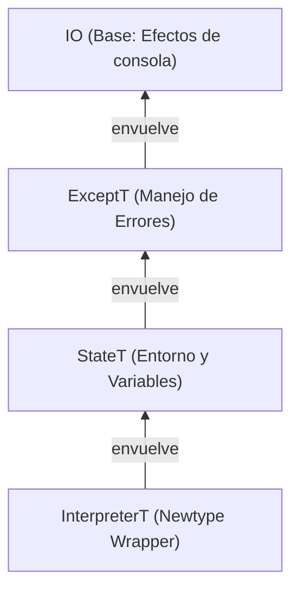

<!-- LTeX: language=es -->

> [!info] O, en resumen,
> _Qué tal estuvo implementar un lenguaje de programación orientado a objetos basado en clases
> usando **programación funcional pura y estáticamente tipada**._
>
> 
>
> Transparencia referencial, inmutabilidad, evaluación perezosa, programación por tipos, mónadas,
> cálculo lambda y otros amigos.

Siempre me atrajo la programación funcional propuesta por **Haskell**.

Programar utilizando propiedades matemáticas, de forma declarativa y con las dependencias
explícitas, ver cómo encajan todas las piezas (y el compilador acepta el programa) cuando tu modelo
de tipos se ajusta al problema, notar cómo tu entendimiento mejora en el proceso.

Otra historia.

Como también me pasa con **Nix**, toda aquella pieza de tecnología con estos principios —a menudo
tras curvas de aprendizaje popularmente elevadas—, que prometa a cambio una mejor perspectiva sobre
la programación o alguno de sus aspectos tangenciales suele ganar mi interés.

Quizá solamente es porque juego al Bloodborne y
aplico su filosofía a todos los demás aspectos de mi vida.
En cualquier caso, desde hace años, Haskell es mi lenguaje para proyectos paralelos
y mis entornos de desarrollo y despliegue se describen vía Nix.

Estas perspectivas me acompañan hoy día en mi trabajo diario con Rust, mi lenguaje profesional.
Creo que soy mejor programador gracias a ellas.

## Fabricando intérpretes

Algunos miembros del equipo de Agent Control en New Relic tenemos un club de lectura semanal.
Hace unos meses seleccionamos **Crafting Interpreters** de Robert Nystrom (puedes leerlo
gratis en [su web](<https://www.craftinginterpreters.com>)), en gran parte por ser de naturaleza más
práctica que las lecturas anteriores ([**Rust for Rustaceans**](https://rust-for-rustaceans.com) de
Jon Gjenset y [**Asynchronous Programming in Rust**](https://www.packtpub.com/en-us/product/asynchronous-programming-in-rust-9781805128137) de Carl Fredrik Samson).

El libro implementa un lenguaje de programación orientada a objetos simple llamado **Lox**. Lo hace
dos veces, con estrategias y lenguajes diferentes cada vez. Primero en Java (`jlox`) mediante
recorrido de árboles, luego en C (`clox`) con una máquina virtual de _bytecode_.

Como no queríamos hacer la primera parte en Java (xd) cada uno de nosotros escogió su propio
lenguaje para la primera parte del libro.

Así que ahora ya sabes a qué vino la introducción.

Este artículo explora varios aspectos de mi implementación de `jlox` en Haskell.

> [!tip] ¡Puedes ver mi implementación mientras lees!
> El código de mi implementación, llamada (no muy originalmente) `hox`, está publicado
> [en GitHub](https://github.com/DavSanchez/hox).
> Pasa toda la _suite_ de tests del repositorio oficial de Crafting Interpreters (más sobre esto a
> continuación) para `jlox`, por lo que es conforme a lo especificado en el libro.

Vamos allá.

## Entorno reproducible con Nix

Te lo dije.

Haskell utiliza [`cabal`](https://www.haskell.org/cabal/) como gestor de proyectos. Creo que, aún
con sus asperezas, es una herramienta bastante buena. Sin embargo, como ya decía al principio,
me gustan mis dependencias controladas y descritas lo más completamente posible. #nix es un viejo conocido en este sitio, y por descontado la mejor herramienta a día de hoy para encargarse de eso.

Así que antes de escribir mi primera línea de Haskell me aseguré de que mi entorno de desarrollo
fuese un [_flake_](./hispanix/2024-06-25-entornos-desarrollo.md) en condiciones.
Con el _flake_ pude establecer algunos aspectos que quería desde el minuto uno:

- La versión del compilador que me interesaba
(GHC 9.12.2, para probar las extensiones de [GHC2024](https://ghc.gitlab.haskell.org/ghc/doc/users_guide/exts/control.html#extension-GHC2024))
- Un formateador "único" para todos los tipos de fuentes del proyecto con
[`treefmt`](https://github.com/numtide/treefmt).
- _Pre-commit hooks_ para todas las comprobaciones que me interesaban,
incluyendo _hooks_ custom (`hlint`, `weeder`, `doctest`, etc).
- Un _shell_ de desarrollo con todas las dependencias listas (incluyendo formateador y _hooks_).

Más relevante que todos estos aspectos para comprender la potencia de Nix es el cómo pude utilizarlo
para ejecutar los tests del [repositorio](https://github.com/munificent/craftinginterpreters) de
Crafting Interpreters.

El código de los bancos de tests está escrito en Dart 2, y desde 2023 Dart está en la versión 3.
Dart 3 obliga a asegurar la _Null Safety_, cosa que los tests no habían hecho porque la versión 2 no
lo requiere, así que estos tests no funcionan con la última versión. Si fuese un programador de Dart
y tuviese instalada la versión 3 tendría que pelear con mi entorno para instalar la versión 2 y
poder ejecutar los tests sin alterar mi entorno habitual.
Tal vez alguna herramienta tipo `nvm` para Dart, `asdf` o contenedores...

Pero como uso Nix, no tengo que preocuparme de este problema en absoluto. No tengo que conocer
herramientas específicas para el lenguaje de turno ni arriesgarme a conflictos con herramientas
instaladas globalmente (un saludo, Python).

Busco Dart en el repositorio de paquetes más grande y más actualizado del mundo, `nixpkgs`. Busco
la revisión de `git` de `nixpkgs` que contenga la versión de Dart que me sirve. Fijo la revisión
como entrada a mi _flake_... y listo, **Dart 2.19.6** listo para ejecutar en mi terminal. Gracias a
`direnv`, en el momento en el que salgo del directorio del proyecto el ejecutable de `dart`
desaparece (o volvería a la 3.9.4 si fuese un programador de Dart con una instalación global).

De nuevo, tirando de las funciones de Nix escribo un _script_, también en Haskell, (**_inline!_**)
que llama a Dart como si fuese un _script_ de Bash, de forma que puedo ejecutar los tests de cada
capítulo de forma aislada y pasándole mi implementación del intérprete.

¿Cómo? mira esto (sacado del repo de [Shh](https://github.com/luke-clifton/shh#nix)):

```nix
writers.writeHaskellBin "example" { libraries = [ haskellPackages.shh ]; } ''
  {-# LANGUAGE TemplateHaskell #-}
  import Shh

  -- Load binaries from Nix packages. The dependencies will be captured
  -- in the closure.
  loadFromBins ["${git}", "${coreutils}", "${curl}"]

  main :: IO ()
  main = do
    cat "/a/file"
    cp "/a/file" "/b/file"
''
```

Fíjate en el comentario del centro. Hasta la versión de las `coreutils` está fijada por Nix.

Es un nivel de control inigualable, no vuelves a mirar (ni a ejecutar) un _script_ de Bash igual.

Por supuesto, automatizar la ejecución de estos tests en la CI (mismas versiones de programas, etc,
etc) es trivial. Esto da confianza absoluta: puedo saber si mi implementación actual supera los
tests oficiales y seleccionar granularmente cuántos y cuáles capítulos compruebo, independientemente del lenguaje que haya escogido.

Escribí mi CI para que cada _pull request_ al repositorio implementando un capítulo
debiese pasar todos los tests de dicho capítulo. Nada de medias tintas.

Si quieres verlo, echa un vistazo a mi [`flake.nix`](https://github.com/DavSanchez/hox/blob/1eb3f09d00cf3f1c627bfddd2963441cb2dadef2/flake.nix#L48-L127).

## Escaneando: de la mutabilidad a la recursión de cola

El primer paso de cualquier intérprete es el escáner (o _lexer_). En Java, Nystrom usa estructuras
habituales, `while`s que avanzan sobre la cadena de caracteres de entrada, mutando el estado en cada
iteración (`while (!isAtEnd()) { start = current; ... }`).

¿Cómo te aproximas a esto en Haskell, donde casi todo es inmutable y no hay estado? No es cuestión de tirar de `map` o `foldl` sobre listas de caracteres, porque
puedes necesitar más que un carácter cada vez para determinar ante qué _token_ te
encuentras. Cuando llegas a `=` necesitas más para saber si estás ante un **signo
de igual** o ante un **operador lógico** `==`.

La respuesta a que no haya estado mutable es **llevar el estado contigo en la función**, llamándola recursivamente y pasando explícitamente el estado
actualizado. ¿Te suena lo de las dependencias
explícitas?.

Este es el tipo de mi función de escaneo en Haskell.

> [!info] _First time?_
> Si nunca has visto una firma de tipos de
> Haskell, asume que todos los tipos que aparecen excepto el último son parámetros de la función,
> y el tipo que aparece al final es el tipo de retorno.
>
> Para saber más, lee sobre el [_currying_](https://en.wikipedia.org/wiki/Currying).

```haskell
-- | Scans the input strings and tracks the state: the current line number and the accumulated tokens
naiveScanTokens ::
  -- | Input string (a linked list of characters, `String` == `[Char]`)
  [Char] ->
  -- | Current line number
  Int ->
  -- | Accumulated tokens (my state!)
  [TokenResult] -> 
  -- | Resulting list of tokens, a non-empty list, can contain scanning errors
  NonEmpty TokenResult
```

> [!note] ¿Naíf?
> La función se llama `naiveScanTokens` porque inicialmente exploré, aparte de
> esta versión literalmente escrita caso a caso según leía, otra versión utilizando
> _combinadores monádicos_ (ya, ya. Sigue leyendo) y la biblioteca
> [`megaparsec`](https://hackage.haskell.org/package/megaparsec).
>
> Finalmente descarté esta segunda opción por una cuestión didáctica a varios niveles:
>
> - Calentamiento después de un par de meses sin tocar Haskell.
> - No usar bibliotecas externas en la implementación.
> - La sección de _parsing_ ya me permitiría usar, también manualmente, los combinadores.
> - Introducir algunos patrones de programación funcional y Haskell a mis compañeros de equipo.
> - Escribir este artículo algún día.

La implementación simplemente hace _pattern matching_ sobre los caracteres de entrada y llama a la
misma función actualizando el estado hasta que termina. Fíjate en cómo capturo cada carácter y cómo
vinculo el resto de la lista a `ss` con el operador `:` en los argumentos de entrada, en el lado
izquierdo de la definición, para pasarla a la nueva llamada en el lado derecho, y cómo en el caso
base añado del estado de entrada (el argumento `tt`) el token `EOL` a la lista de salida (por eso
nunca está vacía) con `:|`.

```haskell
-- We start with the base case: no more characters to process, I just add the EOF token
naiveScanTokens "" l tt = validToken EOF l :| tt
naiveScanTokens ('(' : ss) l tt = naiveScanTokens ss l (validToken LEFT_PAREN l : tt)
naiveScanTokens (')' : ss) l tt = naiveScanTokens ss l (validToken RIGHT_PAREN l : tt)
-- ...
-- Operators
naiveScanTokens ('!' : '=' : ss) l tt = naiveScanTokens ss l (validToken BANG_EQUAL l : tt)
naiveScanTokens ('!' : ss) l tt = naiveScanTokens ss l (validToken BANG l : tt)
-- ...
-- Whitespaces (no newlines)
naiveScanTokens (s : ss) l tt
  | s == ' ' || s == '\r' || s == '\t' =
      naiveScanTokens ss l tt
-- ... all other cases
-- If we reach here, it means we encountered an unexpected character
naiveScanTokens (s : ss) line tt = naiveScanTokens ss line (syntaxError "Unexpected character." line [s] : tt)
```

Tienes una función definida varias veces según los diferentes comportamientos que quieres.
Es como sobrecargar una función por posibles sus valores de entrada.

El código es casi una transcripción directa de las instrucciones del libro. Iba añadiendo los casos
a la función según los leía, pero sin contadores manuales ni constructos de control
de flujo `while` o `for`. Llamada Datos y estado de entrada, transformación, y
nueva llamada con nuevos datos y estado.

Solo hay que pasar un estado inicial (la primera línea y la lista vacía de resultados) junto a la
entrada, que es lo que hago con `scanTokens` (esta solo tiene que aceptar el verdadero _input_):

```haskell
scanTokens :: String -> NonEmpty TokenResult
scanTokens s = reverse (naiveScanTokens s 1 [])
```

Puedes ver la implementación completa de `naiveScanTokens` en mi repositorio ([`Scanner/Naive.hs`](https://github.com/DavSanchez/hox/blob/d318b821e162fcd548841b0f7f5d1a9bfd380169/src/Language/Scanner/Naive.hs#L100))

## _Visitor_ vs _Pattern Matching_ de tipos suma

La sección [_Working with trees_](https://www.craftinginterpreters.com/representing-code.html#working-with-trees)
del capítulo 5 explora las diferencias expresivas entre el paradigma orientado a
objetos y el paradigma funcional, y cómo el patrón de diseño _visitor_ trata de
acercar el estilo funcional al orientado a objetos.

Por supuesto, al acercarme al problema desde la programación puramente funcional,
no iba a necesitar implementar el patrón _visitor_. Como el propio libro menciona:

> Each kind of expression in Lox behaves differently at runtime. That means the
> interpreter needs to select a different chunk of code to handle each expression
> type. With tokens, we can simply switch on the TokenType. But **we don’t have a
> “type” enum** for the syntax trees, just a separate Java class for each one.

¡Nosotros sí que tenemos ese _“type” enum_!

El sistema de tipos de Haskell es una de sus grandes fortalezas. En particular,
tenemos a nuestra disposición los **ADTs** (_Algebraic Data Types_), y su forma
de tipos suma (que también se ve en los `enum` de Rust) cubre este caso con total
naturalidad, particularmente con la sintaxis de Haskell.

La gramática formal para las expresiones de Lox empieza así, sacada tal cual
del libro:

```txt
expression     → literal
               | unary
               | binary
               | grouping ;
```

Y la primera versión de mi AST de expresión expresada como un tipo en Haskell
se veía así:

```haskell
-- | Represents an expression in the AST.
data Expression = Literal Literal
                | Unary UnaryOperator Expression
                | Binary BinaryOperator Expression Expression
                | Grouping Expression
```

Hay información que falta en cada uno de los fragmentos, claro, pero imagino que
pillas la idea 😎.

El intérprete se reduce a una función que encaja cada patrón, como el escáner,
pero esta vez sobre los constructores de variantes del tipo.
Es una solución más concisa que evita escribir un puñado de clases sin métodos para
implementar _visitor_, y por supuesto te ahorra escribir el generador que el autor
tiene que fabricar para agilizar el añadido de dichas clases (son 21).

Puedes ver mi tipo de expresión actual en [`Syntax/Expression.hs`](https://github.com/DavSanchez/hox/blob/d318b821e162fcd548841b0f7f5d1a9bfd380169/src/Language/Syntax/Expression.hs).

## Parseando: combinadores monádicos

Esta sección creció demasiado, así que he decidido extraerla en su propio artículo para darle la atención que merece.

Si quieres saber cómo funcionan los _parsers_ monádicos, qué tienen que ver con `Result::and_then` en Rust y cómo se combinan para crear estructuras complejas a partir de piezas simples, echa un vistazo a:

👉 **[Combinadores de Parsers Monádicos](./BLOG_DRAFT_PARSERS.md)**

Allí explico en detalle cómo pasamos de la idea de un escáner manual a una abstracción mucho más potente y reutilizable.

## Codificando la distancia de resolución de variables en el AST

Uno de los desafíos más interesantes fue el capítulo de **Resolución de Variables**. En Lox, para manejar cierres (closures) correctamente, necesitamos saber a cuántos "saltos" (scopes) de distancia está definida una variable.

### La solución Java: Side-Tables

En Java, el Resolver recorre el árbol y guarda esta información en un `Map<Expr, Integer>` separado. El AST no cambia. Esto funciona en Java porque cada objeto `Expr` tiene identidad (dirección de memoria) y puede usarse como clave en un mapa.

### El problema en Haskell

En Haskell, los valores son inmutables y estructurales. `Variable "a"` es idéntico a otro `Variable "a"`. No tienen "identidad" por defecto. Para usar un `Map`, necesitaría adjuntar IDs únicos a cada nodo o usar trucos inseguros.

### La solución Haskell: Tipos Dependientes de la Fase

En lugar de una tabla lateral, decidí que la información de resolución debía vivir **dentro** del propio AST. Pero el Parser no conoce esa información todavía. ¿Cómo definimos un tipo que a veces tiene resolución y a veces no?

Usé una técnica inspirada en el paper ["Trees That Grow"](https://www.microsoft.com/en-us/research/publication/trees-that-grow/), utilizando **Data Kinds** y **Type Families**:

```haskell
-- Definimos las fases del compilador
data Phase = Unresolved | Resolved

-- Una familia de tipos que cambia según la fase
type family ResolutionInfo (p :: Phase) :: Type where
  ResolutionInfo 'Unresolved = NotResolved  -- Un tipo vacío
  ResolutionInfo 'Resolved = Resolution     -- La distancia calculada (Global | Local Int)

-- El AST usa esta familia de tipos
data Expression (p :: Phase)
  = VariableExpr
      Int                -- Línea
      String             -- Nombre
      (ResolutionInfo p) -- ¡Cambia según la fase!
  -- ...
```

Esto es **Type-Driven Development** puro.

1. El `Parser` produce un `Program 'Unresolved`.
2. El `Resolver` toma un `Program 'Unresolved` y devuelve un `Program 'Resolved`.
3. El `Interpreter` **solo** acepta `Program 'Resolved`.

```haskell
-- Interpreter.hs
programInterpreter :: Program 'Unresolved -> Interpreter ()
programInterpreter prog = do
  let (resolvedProg, errors) = runResolver (programResolver prog)
  if null errors
    then interpretProgram resolvedProg -- Aquí GHC sabe que es seguro
    else throwError (Resolve errors)
```

Si intento ejecutar un programa sin resolver, ¡el código ni siquiera compila! Es una garantía de seguridad que Java no puede ofrecer tan fácilmente.

## 6. Arqueología de Tipos: El Paso por GADTs

En las primeras etapas de este proyecto, experimenté con **GADTs (Generalized Algebraic Data Types)** para representar el AST. La idea era ambiciosa: codificar en el sistema de tipos que ciertas operaciones solo eran válidas en fases específicas. Por ejemplo, que el constructor `Variable` solo pudiera contener una `Resolution` si el tipo de la expresión era `Resolved`.

```haskell
data Expression p where
  VariableExpr :: String -> Resolution -> Expression 'Resolved
  -- ...
```

Sin embargo, pronto me topé con la rigidez de este enfoque para un AST tan grande. Aunque extremadamente seguro, los GADTs pueden complicar tareas como el derivado automático de instancias (`Show`, `Eq`) y requieren un "ceremonial" de tipos que a veces oscurece la lógica del compilador.

Finalmente, pivoté hacia el patrón **"Trees That Grow"** (usando `DataKinds` y `TypeFamilies`) que mencioné antes. Es una solución más "haskelliana" para este problema específico: permite extender el AST con metadatos según la fase sin perder la ergonomía de los ADTs tradicionales.

## 7. Gestionando el Estado: Capacidades y MTL

En Java, el intérprete es una clase con campos mutables (`environment`). En Haskell, la mutabilidad y los efectos deben ser explícitos. Mi implementación utiliza la librería [**MTL (Monad Transformer Library)**](https://hackage.haskell.org/package/mtl) para construir una "cebolla" de efectos:

```haskell
newtype InterpreterT m a = Interpreter
  { runInterpreterT :: StateT (ProgramState Value) (ExceptT InterpreterError m) a
  }
```

Visualmente, la pila de efectos se ve así:



Lo interesante aquí no es solo la pila de mónadas, sino cómo se utiliza. Siguiendo las mejores prácticas, la mayoría de las funciones del intérprete no conocen esta pila concreta. En su lugar, utilizan **restricciones de clases de tipos** (capabilities):

```haskell
evaluateExpr :: (MonadState (ProgramState Value) m, MonadError InterpreterError m) => Expression 'Resolved -> m Value
```

Esta firma dice: "esta función funciona en cualquier mónada `m` que tenga un estado de tipo `ProgramState` y pueda lanzar errores de tipo `InterpreterError`". Esto desacopla la lógica de la implementación concreta, facilitando los tests y permitiendo reutilizar funciones en diferentes contextos (como el Resolver, que comparte algunas de estas capacidades pero no todas).

Un detalle elegante es cómo se manejan los scopes. En Java se usa `try-finally` para asegurar que, al salir de un bloque, el entorno anterior se restaura. En Haskell, uso `catchError` junto con las primitivas de estado:

```haskell
executeBlock decls = do
  modify pushScope        -- Entrar en nuevo scope
  -- Si 'go decls' falla, ejecutamos el handler que hace popScope y relanza el error
  r <- catchError (go decls) (\e -> modify popScope >> throwError e)
  modify popScope         -- Salir del scope (caso exitoso)
  pure r
```

## 8. Errores como Valores

Una de las diferencias filosóficas más grandes es el manejo de errores. En lugar de que el flujo de control salte mágicamente (Exceptions), los errores son valores (`Left InterpreterError`) que se propagan.

Aunque `ExceptT` hace que parezca imperativo (puedes hacer short-circuiting), te obliga a ser consciente de en qué partes del código pueden fallar las cosas. No hay "Unchecked Exceptions" aquí.

## 9. Azúcar Sintáctico: Pattern Synonyms

En mi implementación del flujo de control (bucles, retornos de función), me encontré con un patrón común. Necesitaba un tipo que representara "seguir ejecutando" o "detenerse y devolver un valor".

Podría haber usado `Either b c`, pero quería algo más descriptivo. Definí `ControlFlow`:

```haskell
data ControlFlow b c
  = Break b     -- Detener el flujo con un valor (ej. return)
  | Continue c  -- Seguir ejecutando
```

Sin embargo, leer `Break` cuando estamos implementando una sentencia `return` es cognitivamente disonante. Aquí es donde los **Pattern Synonyms** de Haskell brillan. Me permiten crear un "constructor virtual" que aliasa a uno existente:

```haskell
{-# LANGUAGE PatternSynonyms #-}

pattern Return :: b -> ControlFlow b c
pattern Return x = Break x
```

Ahora, mi código del intérprete puede usar `Return` como si fuera un constructor real, haciendo que la intención sea cristalina:

```haskell
runFunctionBody (d : ds) =
  interpretDeclF d >>= \case
    Return v -> pure v        -- ¡Se lee como inglés!
    Continue () -> runFunctionBody ds
```

Es un pequeño detalle, pero demuestra cómo Haskell te permite modelar el dominio de tu problema no solo en los tipos, sino también en la sintaxis misma. ¿Es sobre-ingeniería para un intérprete de juguete? Quizás. Pero parte de la diversión de usar un lenguaje expresivo es ver hasta dónde puedes doblarlo para que se ajuste a tus conceptos mentales, y no al revés.

## 10. Propiedades, no solo Tests

Además de la suite oficial de tests de Lox (que son casos de ejemplo específicos), aproveché el ecosistema de Haskell para añadir **Property-Based Testing** con `QuickCheck`.

En lugar de escribir `assert(scan("((") == [LEFT_PAREN, LEFT_PAREN])`, defino propiedades universales que mi código debe cumplir para _cualquier_ cadena de entrada generada aleatoriamente. Por ejemplo, mi escáner debe cumplir siempre que:

1. La lista de tokens resultante nunca puede ser más larga que la cadena de entrada (más uno por el EOF).
2. El escaneo siempre termina en un token `EOF` o en un error de "String no terminado".

```haskell
-- test/Scanner/Props.hs
scannerProperties :: TestTree
scannerProperties = 
  testGroup "Scanner Property Tests"
    [ testProperty "Always ends in EOF or an unterminated string error" eofOrUnterminatedString
    , testProperty "Less or equal tokens than input length" lessOrEqualTokensThanInputLength
    ]
```

Es una forma de testear que encuentra casos borde (como cadenas vacías, o llenas de caracteres nulos) que a un humano difícilmente se le ocurrirían escribir manualmente.

## 11. Midiendo el Rendimiento: Benchmarks en CI

No se puede mejorar lo que no se mide. Para asegurarme de que mis refactorizaciones "idiomáticas" no destrozaran el rendimiento del intérprete, integré una suite de **benchmarks** utilizando `tasty-bench`.

Elegí `tasty-bench` sobre el clásico `criterion` por su ligereza y su integración natural con el resto de mi infraestructura de tests. El benchmark canónico para intérpretes es la función de Fibonacci recursiva, que estresa la resolución de variables, las llamadas a función y las operaciones aritméticas básicas.

```haskell
-- bench/Main.hs
main :: IO ()
main = defaultMain
  [ bgroup "Interpreter"
      [ bench "fib(20)" $ whnfIO $ runInterpreter $ buildTreeWalkInterpreter $ Right $ tokens 20
      , bench "fib(25)" $ whnfIO $ runInterpreter $ buildTreeWalkInterpreter $ Right $ tokens 25
      ]
  ]
```

Pero ejecutar benchmarks en mi máquina no es suficiente. Quería visualizar la tendencia histórica. Para ello, configuré un workflow de **GitHub Actions** que:

1. Ejecuta los benchmarks en Linux (x64 y ARM) y macOS.
2. Convierte los resultados a JSON usando un pequeño script de Python.
3. Utiliza la acción `benchmark-action/github-action-benchmark` para generar gráficas de evolución y alertar si un commit introduce una regresión de rendimiento superior al 150%.

Esto convierte el rendimiento en una propiedad observable del proyecto, tan importante como la corrección del código.

## Conclusión

Implementar Lox en Haskell ha sido un ejercicio de traducción cultural.

- Donde OOP ve **Comportamiento encapsulado con Datos**, FP ve **Datos puros y Funciones transformadoras**.
- Donde OOP usa **Identidad de Objetos**, FP usa **Tipos Estructurales**.
- Donde OOP usa **Excepciones y Mutabilidad**, FP usa **Mónadas y Transformadores**.

Arquitecturas como la **Resolución basada en Tipos** me han mostrado un poder de expresividad y seguridad que difícilmente quiero abandonar para volver al mundo de `void foo()`. Haskell es una herramienta inmensamente poderosa que no solo resuelve problemas, sino que afila la mente del programador en el proceso.

El código completo está disponible en el repositorio.

¿El siguiente paso? El libro _Crafting Interpreters_ tiene una segunda parte: una máquina virtual de bytecode escrita en C (`clox`). Para cerrar el círculo, planeo implementar esta segunda parte en **Rust**, aplicando (o ignorando deliberadamente) las lecciones funcionales aprendidas aquí en un entorno de sistemas de bajo nivel.

¡Feliz hacking funcional!
